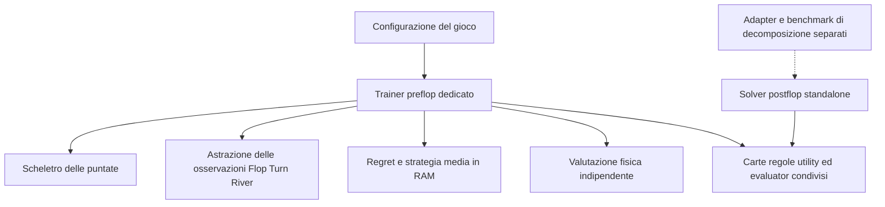

# Roadmap operativa per l'agent coder: preflop HU Short Deck entro due ore

## 1. Mandato e risultato richiesto

Realizzare un percorso preflop CPU/RAM che apprenda una strategia dell'intero gioco, dal preflop al River, e produca range preflop ed EV confrontabili con il benchmark HU CO 40a in meno di 7.200 secondi. Il risultato deve includere una policy consultabile, la sua valutazione nel gioco fisico e un report riproducibile.

Il nuovo percorso deve essere **indipendente dal motore del solver postflop standalone**, così che quest'ultimo possa essere modificato separatamente. Le continuazioni Flop/Turn/River saranno apprese dal trainer preflop mediante una rappresentazione astratta. Il solver standalone non sarà chiamato per risolvere ogni continuazione, né usato obbligatoriamente per generare i valori delle foglie.

Questo documento definisce il lavoro futuro dell'agent coder. La sua creazione non avvia l'implementazione. Quando ne viene richiesta l'esecuzione, procedere nelle fasi autorizzate senza chiedere conferma a ogni passaggio; fermare soltanto le attività che richiedono una decisione fuori dal perimetro o dipendono da un gate fallito.

Il riferimento tecnico è lo [studio CPU/RAM](C:/Users/GoryNickel/Documents/GitHub/GTO-Solver/docs/research/HU_PREFLOP_CPU_RAM_2H_ARCHITECTURE_STUDY_2026-09-10.md). Questa roadmap ne rende operativi i criteri e aggiunge un vincolo di isolamento più forte: il riuso di kernel interni del postflop non è una dipendenza ammessa per il primo percorso preflop.

### Ordine di priorità vincolante

1. **Isolare il preflop dal solver postflop** con R0–R1, eliminando le dipendenze residue e rendendo separati i due percorsi di lavoro.
2. **Correggere l'averaging e validare il trainer su giochi ridotti** con R2, prima di interpretarne le strategie o i benchmark.
3. **Verificare la nuova astrazione con esperimenti brevi** con R2.1, prima di investire nel completamento delle ottimizzazioni R3–R4, nel parallelismo o nei run lunghi.

R2.1 anticipa la verifica di fattibilità dell'astrazione; R5 ne completa successivamente l'implementazione sul layout definitivo. I numeri delle fasi esistenti restano stabili. Prima di R2.1 sono ammessi soltanto gli interventi minimi necessari a eseguire e misurare il prototipo entro limiti di tempo e memoria dichiarati, non una campagna di ottimizzazione del motore.

### Criteri finali

| Requisito | Criterio |
|---|---|
| Tempo specifico del caso | Meno di 7.200 s, inclusi preparazione, training, valutazione finale ed esportazione |
| Hardware | CPU e RAM locali; al massimo 8 thread; niente GPU o servizi remoti |
| Strategia preflop | 81 classi esatte, 630 combo, pesi reali 6/4/12 |
| TV media per classe, pesata sulle combo | ≤ 2 punti percentuali |
| MAE per azione/classe, pesato | ≤ 1 punto percentuale; con cinque azioni TV = 2,5 × MAE |
| Massimo errore delle frequenze root aggregate | ≤ 1 punto percentuale |
| P95 della TV per classe, pesato | ≤ 5 punti percentuali |
| EV CO | Target −0,30 ante; errore assoluto ≤ 0,05 ante, accompagnato da IC |
| Evidenza statistica proposta per l'EV | `abs(EV_stimata - (-0,30)) + semilarghezza_IC95 <= 0,05` |
| Soluzione | Strategia media di entrambi i giocatori, interrogabile e rileggibile |
| Certificazione dell'intero gioco | Separata; non richiesta entro le due ore e non dichiarata disponibile |

Le soglie di frequenza e il target EV provengono dalla [fixture di riferimento](C:/Users/GoryNickel/Documents/GitHub/GTO-Solver/benchmarks/fixtures/hu_preflop_co40_reference_v1.json). Il criterio con IC è una regola aggiuntiva di questa roadmap. Il riferimento esterno ha configurazione incompleta e frequenze arrotondate: un esito positivo attesta vicinanza ai dati disponibili, non equivalenza dimostrata con il Monker privato.

Le due ore riguardano un run qualificato. Non sono una stima del tempo necessario per implementare il sistema o completare tutti gli esperimenti della roadmap. Il raggiungimento dei gate resta da dimostrare.

## 2. Confine fra preflop e solver postflop

### Stato verificato nel repository

Il trainer campionato chiama la propria `traverse_postflop` quando arriva a una continuazione, anziché `solve_postflop_exact`. La libreria `gtosd::preflop` dichiara dipendenze da core, equity e tree. [Traversata](C:/Users/GoryNickel/Documents/GitHub/GTO-Solver/libs/preflop/src/hu_preflop_solver.cpp:724), [CMake](C:/Users/GoryNickel/Documents/GitHub/GTO-Solver/libs/preflop/CMakeLists.txt:19).

L'isolamento attuale è però incompleto:

1. [hu_preflop.hpp](C:/Users/GoryNickel/Documents/GitHub/GTO-Solver/include/gtosd/preflop/hu_preflop.hpp:5) include `gtosd/postflop/root_values.hpp`.
2. [hu_preflop_decomposition.cpp](C:/Users/GoryNickel/Documents/GitHub/GTO-Solver/libs/preflop/src/hu_preflop_decomposition.cpp:2) include l'header del solver postflop e contiene contratti del vecchio percorso di decomposizione.
3. Il [benchmark di decomposizione](C:/Users/GoryNickel/Documents/GitHub/GTO-Solver/benchmarks/hu_preflop_decomposition.cpp:297) chiama il solver postflop esatto e collega il target sperimentale corrispondente.

L'assenza di chiamate al solver nella traversata campionata non dimostra quindi che tutti i target preflop possano essere compilati indipendentemente dai suoi header.

### Architettura richiesta

Il trainer dedicato risolve anche le decisioni delle street successive. Sostituirle con equity all-in o check-down cambierebbe il gioco e non soddisferebbe questa roadmap.

Il solver postflop standalone può cambiare algoritmo, layout di memoria, interfaccia e dettagli interni senza richiedere cambiamenti al nuovo trainer, dopo il gate di isolamento. Rimangono condivisi i contratti di carte, regole, utility, range ed evaluator: modificarne il significato o le API richiede coordinamento e nuovi test su entrambi i consumatori. Non promettere indipendenza da questi componenti comuni.

Il lavoro postflop previsto riguarda la velocità dei benchmark che già convergono. Questa roadmap non impone di sospenderlo e non richiede di attendere la chiusura dei suoi gate temporali per sviluppare il trainer dedicato. Il divieto di modificare il postflop si applica all'agent incaricato del preflop; non blocca l'attività di ottimizzazione postflop svolta separatamente. Ogni percorso conserva i propri controlli di correttezza e prestazione.

Se l'ottimizzazione postflop modifica un componente comune, coordinarne l'integrazione con uno snapshot e un confronto prima/dopo sui due consumatori. Un miglioramento di traversal o storage interno del postflop non deve cambiare il preflop; un cambiamento all'evaluator condiviso può invece influire su entrambi. Conservare inizialmente backend e default distinti evita che un esperimento prestazionale si propaghi senza verifica.

Una compilazione completa della GUI o dei vecchi benchmark può continuare a richiedere il postflop. Il vincolo di indipendenza riguarda libreria, eseguibile, valutatore e test dedicati al nuovo percorso preflop. Distinguere sempre questo target minimo dalla build dell'intero prodotto.

## 3. Perimetro dei file

I nomi nuovi sotto indicati sono proposte organizzative, non file già implementati. È possibile adattarli alle convenzioni del repository mantenendo i confini funzionali.

| Area | Intervento ammesso all'agent preflop | Limite |
|---|---|---|
| `libs/preflop/`, `include/gtosd/preflop/` | Separare modello/trunk, trainer e adapter legacy; introdurre contratti del nuovo percorso | Conservare compatibilità delle API legacy usate altrove |
| Nuovo `libs/preflop_blueprint/` e relativo include | Trainer, astrazione, storage, query, valutazione e checkpoint dedicati | Nessun include o link verso il solver postflop |
| `benchmarks/hu_preflop_*`, nuovi test preflop | Runner, report e verifiche del nuovo percorso | Non trasformare report storici o metriche non certificate in PASS |
| CMake root e dei moduli interessati | Collegamenti minimi e target dedicati | Non cambiare i default production del postflop o disabilitarne i test per nascondere errori |
| `libs/equity/` e relativo include | Nuovo backend tabellare opzionale, oppure servizio dedicato che usa l'oracle esistente | Conservare l'evaluator attuale e il backend predefinito del postflop |
| `libs/core/`, `libs/tree/` | Uso dei contratti esistenti; adapter additivi strettamente necessari | Nessun cambio di regole, rounding, utility o significato delle API |
| `libs/solver/src/solver.cpp` | Eventuale correzione circoscritta dell'averaging external sampling con test dedicati | Non cambiare `ProductionDcfr`, schedule o storage del postflop |
| `libs/postflop/`, `libs/postflop_subgame/`, `include/gtosd/postflop/` | Lettura per capire i contratti e confrontare idee | Nessuna modifica da parte dell'agent preflop nell'esecuzione ordinaria |
| GUI, persistence generale e CLI production | Nessun intervento iniziale; preferire un eseguibile preflop dedicato | L'integrazione di prodotto è successiva ai gate del motore |
| Fixture di riferimento, risultati storici, `.tmp/`, `.reasonix/` | Lettura e conservazione | Non riscrivere, ripulire o sostituire evidenze preesistenti |

Se un cambiamento indispensabile esce da questi limiti, produrre prima una proposta concreta con diff previsto, API coinvolte e test. Continuare il lavoro indipendente; non allargare automaticamente il perimetro. Questo vincolo protegge le modifiche postflop svolte separatamente, non impone approvazioni per le normali scelte interne al trainer.

## 4. Regole operative per tutta l'esecuzione

### L'agent deve

1. Lavorare su uno snapshot identificabile, preservando modifiche locali e file non tracciati; registrare hash di sorgenti, configurazioni e strumenti usati.
2. Tenere distinti correttezza dell'algoritmo, errore di astrazione, errore numerico, rumore statistico e differenze rispetto al gioco esterno.
3. Applicare miglioramenti generici per configurazioni supportate, verificandoli anche fuori dal solo CO40.
4. Salvare per ogni esperimento configurazione, algoritmo, seed separati, tempi per componente, memoria di processo, metriche e motivi di esclusione.
5. Procedere in ordine di dipendenze e riportare `PASS`, `FAIL`, `INCONCLUSIVE` o `NOT_RUN` con evidenze, senza dichiarare raggiunti gate non eseguiti.

### L'agent non deve

1. Usare la matrice target come training label, node lock, inizializzazione costruita per imitarla, obiettivo del clustering o tabella speciale selezionata dall'ID del benchmark.
2. Cambiare rake, ranking, size, contributi, convenzioni EV o tolleranze per ottenere numeri più vicini al riferimento.
3. Richiamare il solver standalone nel percorso qualificato, dipendere da un database di suoi solve o costruire una sweep obbligatoria delle 366 milioni di root River.
4. Introdurre GPU, cloud, quantizzazione aggressiva, pruning non verificato o race nei regret per migliorare un tempo senza misurare l'effetto sulla qualità.
5. Dichiarare GTO, exploitability esatta o certificazione globale sulla base di regret astratto, EV self-play, stabilità delle frequenze o risposta appresa limitata.

Il target esterno resta un test di accettazione. La scelta di feature o algoritmo può essere orientata dalle diagnosi degli errori, ma deve mantenere holdout e criteri generici, senza trasformarsi in un adattamento delle 405 frequenze note.

## 5. Fase R0 — Congelare il contratto e preparare il lavoro

**Scopo.** Rendere ogni risultato attribuibile a codice e gioco precisi, prima delle modifiche.

**Da fare.** Inventariare dirty diff e file non tracciati; registrare CPU, RAM disponibile, compiler, build flags e limiti. Usare un checkout isolato quando necessario per evitare conflitti con il lavoro postflop. Un worktree da HEAD può omettere file preflop non ancora committati: trasferire esplicitamente lo snapshot necessario e registrarne gli hash, senza modificare l'originale.

Congelare la fixture CO40 corrente e il suo rapporto con il riferimento: stack 40a; CO con 1a di ante; BTN con 1a di ante più 1a di button blind; call incrementale del CO pari a 1a; rake zero; root fold/call/raise-to 6/raise-to 10/all-in; continuazioni preflop dichiarate. Il candidato locale usa postflop 33%/66%/120%/all-in e terminazione naturale per stack, ma l'equivalenza con l'albero postflop Monker è in attesa di conferma. Conservare l'eccezione esplicita della reraise 14,5a. Verificare unità e segni della utility tramite fold e showdown semplici.

Predisporre un registro di gate e una directory per risultati nuovi, senza sovrascrivere quelli del rapporto precedente. Registrare separatamente stato del nuovo trainer e stato production del postflop.

**Da non fare.** Non eseguire reset/clean, non assumere che lo SHA Git identifichi il working tree, non lanciare subito un run da due ore.

**Gate R0.** Manifest riproducibile, configurazione validata, confronto delle frequenze arrotondate definito, file protetti identificati e build Release riferita allo snapshot giusto. Nessuna rivendicazione prestazionale in questa fase.

## 6. Fase R1 — Isolare il nuovo trainer dal postflop standalone

**Prerequisito:** R0.

**Da fare.** Separare i tipi del gioco preflop e le sue configurazioni dai tipi di boundary/CFR-D. Per esempio, introdurre un header leggero di modello e una libreria con config, trunk e scheletro delle puntate; lasciare i contratti di decomposizione in un adapter legacy. Il vecchio header può restare un aggregatore compatibile, mentre il nuovo trainer deve includere esclusivamente i contratti leggeri.

Non collegare indiscriminatamente il nuovo target alla libreria legacy se questo trascina la compilazione di `hu_preflop_decomposition.cpp` e degli header postflop. Rendere esplicita la catena minima: modello/configurazione, core, equity, tree necessario, trainer e valutatore. Separare gli eventuali adapter da questa catena.

Il nuovo eseguibile deve poter essere compilato e avviato senza compilare o collegare `gtosd_postflop`, `gtosd_postflop_preflop_experimental` o il modulo di subgame standalone. Conservare i target precedenti per chi continua a usarli.

Un errore preesistente nei benchmark postflop non va riparato dentro questa fase per comodità. Registrarlo separatamente e proseguire con i target indipendenti; un errore del core condiviso che invalida le utility o i test del preflop resta invece bloccante per le attività che ne dipendono.

**Verifiche richieste.** Controllare dipendenze CMake e include transitivi, non soltanto cercare `solve_postflop_exact` nel trainer. Aggiungere una verifica del target minimo che renda rilevabile la reintroduzione della dipendenza. Usare compiler dependency output o un controllo equivalente. Non rimuovere fisicamente file del postflop dal workspace condiviso per simulare l'assenza.

**Da non fare.** Non estrarre kernel modificando il motore postflop; non copiare l'intero solver per rinominarlo; non duplicare il motore delle regole. La duplicazione ammessa è quella di un oracle piccolo e indipendente nei test, con scopo esplicito.

**Gate R1.** Libreria, eseguibile minimo e test del nuovo trainer compilano e funzionano senza dipendenze dal solver standalone, inclusi i suoi header. I percorsi legacy mantengono le API previste. Il gate riguarda l'isolamento del target, non l'assenza di componenti comuni nel repository.

## 7. Fase R2 — Correggere e verificare sampling e averaging

**Prerequisito:** R1 per il nuovo trainer; le verifiche algebriche possono essere preparate dopo R0.

**Da fare.** Scrivere il contratto matematico per probabilità di campionamento, reach, regret, alternanza e strategia media. Derivare il peso atteso dell'accumulo: la probabilità di visita dell'external sampling incorpora già parte della reach. L'attuale accumulo `reach[actor] × strategy` in entrambi i passaggi non deve essere copiato senza correzione.

Usare il [controesempio conservato](C:/Users/GoryNickel/Documents/GitHub/GTO-Solver/docs/research/preflop_12h_evidence_20260910/averaging_counterexample.json) come regressione, aggiungendo un gioco minimo in cui lo stesso giocatore prende più decisioni. Enumerare gli esiti del sampling e confrontare l'aspettativa di numeratore e denominatore della media con la formula di riferimento. Non affidarsi soltanto alla media empirica di rapporti su pochi run.

La prima baseline deve avere una convenzione semplice di external sampling verificata. Aggiungere Linear MCCFR come variante esplicita dopo la baseline, documentando clock, pesi di regret, pesi della media e aggiornamenti lazy. Se si mantiene DCFR, verificare anche cosa accade agli infoset non visitati; non trasferire automaticamente lo schedule 1.5/0/3 del vecchio sampler.

Il MCCFR generico contiene lo stesso problema e non può essere il solo oracle. Se lo si usa nel confronto, correggerlo con una modifica circoscritta e test indipendenti; altrimenti dichiararlo escluso dall'oracle. Usare un CFR deterministico validato sui giochi ridotti.

**Test.** Controesempio algebrico, Kuhn, Leduc e piccolo Short Deck enumerabile; strategia media, payoff, regret e BR esatta dove fattibile. Fissare tolleranze numeriche e statistiche prima del confronto. Conservare seed e curva di convergenza, includendo reach nulla e azioni con probabilità zero.

**Da non fare.** Non abbassare la soglia di un test per renderlo verde, non assumere che due implementazioni concordi siano indipendenti, non introdurre clipping o esplorazione senza correggere lo stimatore, non modificare `ProductionDcfr` per sistemare il sampler.

**Gate R2.** Aspettative coerenti con il contratto, giochi ridotti entro le tolleranze dichiarate, nessuna regressione dei percorsi deterministici interessati. Nessun confronto prestazionale finale prima di questo gate.

### Fase R2.1 — Verificare presto la fattibilità dell'astrazione

**Prerequisiti:** R1 e R2. Il completamento di R3 e R4 non è richiesto.

**Da fare.** Preparare un prototipo minimo della partizione proposta in R5: feature distribuzionali Flop/Turn, forza contro gruppi avversari al River e memoria selettiva esplicita. Usare inizialmente l'evaluator oracle e uno storage semplice con budget rigido. La definizione dei bucket deve essere congelata e distinta dai seed di training e valutazione.

Confrontare la baseline corretta e il prototipo con lo stesso algoritmo, le stesse regole e risorse comparabili. Partire dai giochi ridotti con valutazione esatta, poi da prove CO40 brevi. Prevedere una prima prova di 15 minuti e, se informativa, una successiva fino a 30 minuti per configurazione; riportare preparazione, training e valutazione separatamente nel budget totale della prova. Sono limiti sperimentali, non promesse di convergenza.

Misurare frequenze, EV con incertezza, riuso degli stati, costo delle feature e memoria. Confrontare anche la dispersione dei valori d'azione dentro i bucket. Fissare prima della prova i criteri di confronto e usare seed indipendenti per distinguere un segnale ripetibile dal rumore. I gate finali del benchmark non devono essere già raggiunti in questa fase.

**Da non fare.** Non completare preventivamente il backend tabellare, la riscrittura del layout o il parallelismo solo per avviare questo confronto. Se il prototipo non entra nel budget, misurare la causa e introdurre esclusivamente l'intervento minimo necessario, oppure restringere il gioco diagnostico dichiarandolo. Non sostituire una prova fisica con il solo regret dell'astrazione.

**Gate R2.1.** Prototipo corretto sui giochi ridotti, risorse controllate e confronto riproducibile con la baseline. L'esito deve giustificare la rappresentazione da portare nelle fasi successive tramite un vantaggio di qualità, un compromesso qualità/costo misurato o una diagnosi concreta del limite residuo. Se i dati sono inconcludenti, definire il prossimo esperimento breve; se la rappresentazione peggiora sistematicamente, rivederla. Non passare automaticamente a un run di due ore o a ottimizzazioni profonde.

## 8. Fase R3 — Ridurre il costo del payoff esatto

**Prerequisiti:** R2 e una decisione motivata sulla rappresentazione dopo R2.1. Gli interventi minimi eventualmente necessari al prototipo restano circoscritti al budget di R2.1.

**Da fare.** Introdurre la cache del vincitore per deal senza condividere utility fra terminali con contributi diversi: si riusa il ranking, mentre settlement e payoff dipendono ancora dallo stato. Implementare come backend opzionale una tabella esatta delle mani a sette carte per il ruleset supportato. Il payload a 32 bit è circa 31,84 MiB; il tempo di costruzione e lookup va misurato.

Mantenere l'evaluator attuale come oracle. La tabella deve avere indice combinatorio validato, codifica che preserva l'ordinamento, fingerprint del ruleset, checksum e gestione esplicita di file mancanti o corrotti. Supportare il ruleset corrente senza fingere compatibilità con ranking differenti. Per altre configurazioni usare l'oracle o restituire un limite esplicito.

Costruire una volta i rank delle mani compatibili quando si riutilizza un board. Distinguere cache del payoff, tabella di hand rank e card abstraction: soltanto l'ultima condivide strategie fra osservazioni diverse.

**Test e benchmark.** Verificare tutte le 8.347.680 combinazioni a sette carte contro l'oracle per la tabella prodotta, oltre a indici, tie, flush/full house e A-6-7-8-9. Registrare questo costo di qualificazione del backend separatamente dai successivi run; il caricamento con verifica d'integrità resta nel run. Misurare lookup, costruzione cold e impatto sul trainer, senza moltiplicare speedup di microbenchmark.

**Da non fare.** Non cambiare il backend predefinito del postflop, non sostituire una coppia fisica di mani con equity media delle classi, non presentare risorse costruite fuori cronometro come un solve cold completo.

**Gate R3.** Equivalenza esatta dell'evaluator sul dominio dichiarato, utility preservate, risorsa identificabile, costo cold/warm e RAM riportati. Scegliere il backend in base al beneficio misurato; una tabella corretta ma più lenta non diventa il default per principio.

## 9. Fase R4 — Compilare il betting e limitare tutta la memoria

**Prerequisiti:** R1, R2, R2.1 e R3.

**Da fare.** Compilare le azioni e le transizioni pubbliche in ID interi prima del training. Conservare history distinte anche quando pot e stack coincidono: uguaglianza dello stato meccanico non implica uguaglianza dei range o della strategia. Verificare ogni transizione contro `legal_actions` e `apply_action` sui casi supportati.

Conservare regret e somme strategiche in array indicizzati per history, giocatore ed etichetta astratta. Iniziare con double e riduzioni ordinate. Togliere stringhe, ricostruzione delle legal actions e allocazioni evitabili dal percorso frequente.

Definire un budget in byte per stato numerico, mapping, cache, baseline, scratch, checkpoint ed esportazione. Le cache delle osservazioni fisiche devono avere un limite ed eviction deterministica o essere sostituite da dati per board riutilizzabili. L'eviction di una feature ricalcolabile non deve cancellare regret o strategia appresa.

Il modello iniziale è `16 × somma(numero_azioni × numero_contesti)` byte per regret e somme double. Il numero di contesti comprende anche texture pubblica e memoria selettiva. Non aggiungere successivamente un prodotto nascosto per board o bucket storici. Il budget iniziale del processo può essere 8–12 GiB, ma deve essere adattato alla RAM realmente disponibile e lasciare margine al sistema.

**Test e benchmark.** Stesso input e stesso ordine di sampling devono produrre policy/valori equivalenti fra layout di riferimento e compilato entro tolleranze prefissate. Misurare RSS/private bytes e componenti allocate separatamente; eseguire una prova abbastanza lunga da verificare che la cache raggiunga il limite e smetta di crescere.

**Da non fare.** Non usare la RAM stimata dei soli array come memoria del processo, non spillare silenziosamente i regret su disco, non introdurre uno stato nuovo per ogni osservazione fisica, non unificare history strategiche tramite il solo pot/stack.

**Gate R4.** Equivalenza del gioco, memoria limitata anche a cache piena, errore esplicito se il budget non basta, assenza di fallback che cambi la strategia sotto pressione di memoria.

## 10. Fase R5 — Consolidare l'astrazione sul layout definitivo

**Prerequisiti:** R2.1 e completamento di R3–R4. La prima verifica dell'astrazione deve essere già avvenuta in R2.1; questa fase completa il mapping, la persistenza e i confronti di capacità sul motore definitivo.

**Da fare.** Separare tre seed: generazione della partizione, training, valutazione. Conservare le 81 classi preflop e la history delle puntate. Confrontare una baseline categoria/equity corretta con un candidato che usi distribuzioni della forza futura al Flop/Turn e vettori di forza contro gruppi avversari al River, arricchiti con texture e blocker.

Definire esattamente quali informazioni pregresse si dimenticano e quali si conservano. La memoria imperfetta è ammessa come scelta esplicita; non comporta una garanzia generale di equilibrio del gioco originale. Evitare di conservare automaticamente il prodotto completo dei bucket di tutte le street.

Il generatore può campionare osservazioni per il clustering. La mappa finale deve essere congelata, versionata e applicabile a osservazioni legali mai viste. Le feature devono dipendere soltanto dalle carte visibili al giocatore: distribuire runout ipotetici per stimare il potenziale è ammesso; leggere il futuro effettivo del deal di training non lo è.

Il trainer iniziale deve campionare deal fisici compatibili e poi mapparli nei bucket. Mantenere così card removal e distribuzione congiunta; per un successivo gioco interamente astratto occorrono operatori chance congiunti validati. Non sostituirli con prodotti di marginali o con una mano rappresentativa per gruppo.

**Esperimenti richiesti.** Usare una piccola scala di capacità, per esempio budget complessivi per history nell'ordine di 256, 1.024 e 4.096 contesti, con allocazione differente per street. Sono punti iniziali da valutare, non parametri ottimali già stabiliti. A partizione e algoritmo fissati, misurare visite per bucket, massa degli stati non addestrati, dispersione dei valori d'azione, errori root e costo della mappatura.

**Test.** Invarianza rispetto ai semi quando applicabile, assenza di leakage, mapping deterministico dopo reload, blocker corretti, nessuna azione illegale o probabilità non normalizzata. Gli stati con strategia ancora iniziale devono essere misurati; non confondere mappa definita ovunque con policy ben appresa ovunque.

**Da non fare.** Non rifare i cluster contro il range corrente a ogni iterazione, non scegliere bucket dalla distanza alle frequenze target, non assumere che più cluster garantiscano miglioramento monotono. Il raffinamento adattivo è successivo e richiede un contratto di migrazione di regret e media.

**Gate R5.** Mapping completo e riproducibile, nessun leakage, costo compatibile con la memoria, confronto fisico rispetto alla baseline e a una rappresentazione più fine su casi ridotti. Se la qualità non migliora, diagnosticare il raggruppamento prima di aumentare la durata.

## 11. Fase R6 — Scegliere algoritmo e parallelismo con esperimenti limitati

**Prerequisito:** una partizione valida e sostenibile da R5.

**Ordine di confronto.** External sampling verificato; Linear MCCFR; baseline di riduzione della varianza; PCS/public outcome sampling come challenger; CFR+/DCFR con traversata completa solo se gli operatori dell'astrazione sono stati costruiti e validati. Il confronto deve distinguere tempo per visita e tempo per raggiungere la qualità richiesta.

Nessuno di questi candidati può chiamare il solver postflop standalone. Un eventuale PCS deve avere traversal e aggregazioni nel nuovo modulo o in utility neutrali già disponibili. Riutilizzare un'idea del kernel postflop non richiede collegarsi al suo motore. La variante full DCFR riguarda il gioco astratto e resta soggetta ai limiti teorici della rappresentazione scelta.

Non è obbligatorio implementare tutte le alternative prima della prima candidata qualificata. Avviare un challenger quando le misure mostrano un limite che può affrontare; registrare le alternative non implementate e il motivo. Schedule predittivi, outcome sampling e depth-limited solving restano opzioni successive, non prerequisiti.

Per il parallelismo, misurare 1, 2, 4 e 8 thread sul PC locale. Definire policy letta dal batch, ordine delle riduzioni e clock degli aggiornamenti. Limitare i buffer dei worker; non replicare tutta la tabella dei regret per ciascun thread. Confrontare anche la qualità a pari secondi: uno speedup nel numero di visite può essere annullato da aggiornamenti troppo ritardati.

**Verifiche.** Baseline di varianza priva di bias sui giochi enumerabili, parallelismo confrontato con il single-thread, risultati riproducibili nella modalità deterministica, precisione dell'aggregazione e memoria misurate. Nessuna race sui dati numerici.

**Da non fare.** Non assumere speedup 8× da otto thread logici, non usare numero di iterazioni come unica prova, non cambiare contemporaneamente partizione, algoritmo e precisione nel confronto che deve spiegare un miglioramento.

**Gate R6.** Candidata scelta con tabella di qualità/tempo/RAM sullo stesso contratto, algoritmo identificato e ragione verificabile per ogni variante esclusa. Un risultato veloce ma molto lontano dai range non passa.

**Stato R6 al 2026-09-13.** V18 è respinta: migliora WMAE e TV esterna del `4,04%`, ma la TV fra
seed peggiora del `18,92%` e l'audit EV non migliora. V17 torna a essere la baseline corrente. La
prossima candidata deve ridurre la TV media fra seed almeno del `10%`, fino a `9,8508 pp`, senza
peggiorare WMAE, TV della policy corrente o audit EV. Il candidato proposto applica Common Random
Numbers a tutti i nodi preflop nel training principale V17; non è implementato né autorizzato.
Dettagli: [decisione dopo V18](research/preflop_r6_20260910/V18_REJECTION_AND_NEXT_GATE_DECISION_2026-09-13.md).

## 12. Fase R7 — Valutazione fisica e stato di qualificazione separato

**Prerequisiti:** query della policy disponibile da R4/R5; candidata da R6 per la misura finale. Sviluppare il valutatore prima degli esperimenti lunghi, così da poterli giudicare.

**Da fare.** Valutare la strategia media di entrambi i giocatori con deal fisici indipendenti dal training, utility originali e mappa di astrazione congelata. Registrare media, varianza, errore standard, IC, numero di campioni e seed. Verificare lo stimatore contro un'evaluazione esatta su giochi ridotti.

Dimensionare il campione con un pilot separato o usare una procedura valida per arresto sequenziale. Non controllare ripetutamente un IC ordinario al 95% fino a ottenere un PASS. Eventuali control variate e integrazione analitica delle azioni devono essere documentate e verificate per bias. I campioni comuni fra due candidate migliorano la misura della differenza, non certificano la qualità assoluta.

Produrre una tabella root per le 81 classi con frequenze, EV della policy e valori delle azioni dove disponibili, specificandone l'avversario e lo stimatore. Le risposte BTN e l'EV delle alternative all-in/call/raise servono a diagnosticare gli scarti; la sola root CO non dimostra equilibrio.

Il comparatore legacy oggi lega la qualificazione alla NashConv certificata. Aggiungere un percorso di report separato, preservando il significato di quello precedente. Proporre campi distinti per corrispondenza delle frequenze, compatibilità EV con IC, tempo, memoria e ambito della certificazione. Un valore di NashConv non disponibile deve restare non disponibile, non essere trasformato in zero.

**Stati richiesti.** `RANGE_EV_MATCH` solo con tutti i gate previsti; `FAIL_RANGE`, `FAIL_EV`, `FAIL_TIME`, `FAIL_MEMORY` per fallimenti misurati; `INCONCLUSIVE_EV` quando l'incertezza impedisce una conclusione. Sono nomi proposti: lo schema può adattarsi alle convenzioni esistenti, mantenendo la separazione semantica. Più fallimenti possono coesistere.

**Da non fare.** Non invocare una BR globale come prerequisito del run da due ore, non chiamare exploitability esatta una risposta appresa, non usare il target nel generatore di deal, non qualificare soltanto la media EV ignorandone l'incertezza.

**Gate R7.** Valutatore validato sul dominio ridotto, report riproducibile, decisione statistica dichiarata, vecchia qualificazione certificata invariata e nuova qualificazione limitata a range/EV.

## 13. Fase R8 — Checkpoint e soluzione consultabile

**Prerequisiti:** layout e partizione stabili. Preparare checkpoint prima dei run lunghi; completare il formato prima della qualificazione finale.

**Da fare.** Distinguere il checkpoint di training dall'export della strategia media. Nel checkpoint salvare regrets, somme, contatori, clock di discount/averaging, stato RNG dei worker, scheduler, baseline di varianza se presenti, configurazione del gioco, partizione, evaluator e rispettivi fingerprint. Salvare soltanto la strategia media non permette una ripresa equivalente.

Usare salvataggi atomici e checksum, con errori espliciti per file corrotto o incompatibile. Definire il comportamento quando cambia il numero di thread: ripresa deterministica soltanto se il contratto lo consente; altrimenti dichiarare il cambiamento o rifiutarlo. Una policy deve poter essere interrogata senza caricare il solver postflop e senza ricostruire feature costose a ogni richiesta.

Per la prima consegna basta un eseguibile dedicato capace di salvare, caricare, interrogare history legali ed esportare i range. La GUI production viene dopo. L'export deve rendere consultabili anche le continuazioni del profilo appreso, con indicazione dell'astrazione e degli stati scarsamente addestrati.

**Test.** Run continuo contro interruzione/ripresa allo stesso punto deterministico; equivalenza delle query prima/dopo export; checksum fallito, versione incompatibile, risorse della partizione mancanti e gestione del limite RAM durante il salvataggio.

**Da non fare.** Non serializzare copie multiple dell'intero stato se fanno superare il budget, non chiamare resumable un file che contiene solo percentuali, non usare un formato del postflop standalone come vincolo per il nuovo motore.

**Gate R8.** Ripresa e consultazione verificate, limiti di memoria rispettati durante I/O, file identificabili e policy autonoma dal solver standalone.

## 14. Fase R9 — Qualificazione entro due ore

**Prerequisiti:** R0–R8 per la candidata scelta. Gli esperimenti opzionali non implementati non impediscono questa fase; i gate di correttezza sì.

Congelare configurazione, algoritmo, partizione, risorse e criteri prima del run finale. Registrare separatamente scenario cold e warm. Risorse specifiche del caso, costruite prima per convenienza, vanno incluse nel costo cold; una risorsa comune già distribuita va dichiarata come prerequisito warm. Nessun tempo offline deve sparire dal rapporto.

| Budget indicativo | Contenuto |
|---|---|
| 0–10 minuti | Risorse, mapping e costruzione del layout |
| 10–90 minuti | Training e diagnostica leggera |
| 90–110 minuti | Valutazione finale su campioni indipendenti |
| 110–115 minuti | Export, rilettura e confronto con il riferimento |
| 115–120 minuti | Riserva; superare o raggiungere 120 minuti fallisce il gate temporale |

Questa distribuzione va adattata alle misure mantenendo il limite totale. Non è un obbligo di fermare il training esattamente al minuto 90 se valutazione e setup richiedono budget differenti. Prevedere un arresto che lasci tempo a esportare e valutare, evitando di usare tutte le due ore per il solo training.

Scegliere la configurazione mediante esperimenti di sviluppo e congelarla prima della prova finale. Usare più seed di training per misurare stabilità; almeno tre run indipendenti per la conferma finale, ciascuno soggetto al limite di due ore. Riportare tutti gli esiti, senza scegliere soltanto quello migliore. Il costo complessivo di queste repliche è distinto dal tempo di un singolo solve.

Aggiungere almeno casi holdout con stack, sizings o distribuzioni iniziali differenti entro il dominio supportato. Non serve che abbiano un target Monker: servono a verificare legalità, generalità, utilità numericamente corretta, continuità del comportamento e confronto con oracle ridotti. Non introdurre una dipendenza dal solver standalone per eseguirli.

**Gate R9.** Range, EV con IC, tempo totale, RAM e consultabilità rispettano il contratto per le repliche dichiarate. Le informazioni esterne mancanti restano dichiarate. Nessun claim di certificazione Nash globale.

Se un gate non passa, salvare il risultato e la diagnosi. Un errore persistente di frequenza con poca variabilità richiede revisione di astrazione, continuazioni o comparabilità del gioco; forte variabilità fra seed richiede analisi del sampling e del budget. Non aumentare automaticamente il tempo o cambiare le soglie.

## 15. Cosa rimandare e quando riaprire la decisione

| Intervento | Stato iniziale | Condizione per valutarlo |
|---|---|---|
| Safe subgame solving e certificazione globale | Fuori dal percorso da due ore | Nuovo obiettivo e misure dei costi di valutazione |
| Riuso diretto del solver postflop standalone | Escluso | Cambio esplicito del vincolo di indipendenza |
| Bucket adattivi o range-aware durante il solve | Successivi | Contratto di migrazione e vantaggio misurato rispetto alla partizione fissa |
| Riduzione delle size o depth limit | Non usare nella candidata di riferimento iniziale | Esperimento separato con errore dichiarato e ripristino del gioco richiesto per il confronto finale |
| Quantizzazione e precisioni compresse | Successive alla baseline double | Evidenza di collo di bottiglia RAM/banda e controllo dell'errore numerico |
| Reti neurali, database di continuazioni, GPU | Non necessari alla prima architettura; GPU esclusa | Nuovo perimetro per GPU; per gli altri, costo totale dimostrato sul budget CPU |
| Integrazione GUI completa | Successiva a R9 | Formato e API del nuovo motore stabili |

Non è richiesto indovinare l'algoritmo di Monker. La scelta si basa sui risultati del motore locale, non su attribuzioni non verificabili al prodotto privato.

## 16. Consegna richiesta all'agent coder

Consegnare cinque elementi:

1. **Codice e confini:** diff per modulo, target autonomo, prova delle dipendenze, elenco dei file condivisi toccati e conferma che il motore postflop protetto non è stato modificato.
2. **Contratti matematici:** algoritmo, averaging, sampling, discount, astrazione, precisione, unità EV e garanzie effettivamente applicabili.
3. **Verifiche:** matrice dei gate R0–R9, comandi, esiti, regressioni e casi non eseguiti, distinguendo test di correttezza e benchmark.
4. **Evidenze:** manifest, configurazioni, partizioni, seed, tempi separati, memoria misurata, range per classe, EV con IC, repliche e holdout.
5. **Artefatti utilizzabili:** checkpoint, policy esportata e rileggibile, comando riproducibile di solve/valutazione/query, rapporto finale con limiti e un solo prossimo intervento prioritario se necessario.

Il lavoro non è concluso perché il programma termina o produce percentuali. Se i gate finali falliscono, consegnare una diagnosi con misure e stato esplicito di obiettivo non raggiunto; non promuovere il candidato in silenzio.

## 17. Ordine da seguire all'avvio

Leggere lo studio e questo documento, registrare lo snapshot, quindi eseguire **R0–R1: contratto e isolamento dal solver postflop**. Proseguire con **R2: averaging e validazione sui giochi ridotti**, poi con **R2.1: esperimenti brevi sull'astrazione**. Soltanto dopo una decisione motivata sulla rappresentazione completare le ottimizzazioni R3–R4, consolidare R5 e passare alle fasi successive. Il raffinamento prestazionale del postflop standalone resta un lavoro separato.

Durante questa preparazione è stato creato soltanto il presente Markdown. Non sono stati modificati sorgenti o fixture, e non sono stati eseguiti nuovi test del solver.
