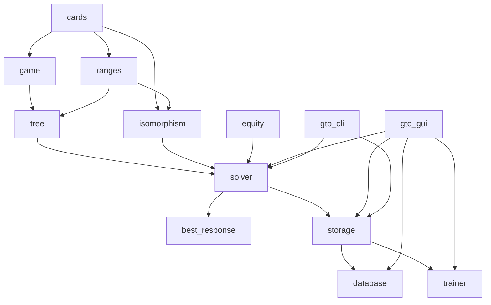

# Roadmap tecnica — GTO Solver Short Deck

I contratti tecnici estratti e mantenuti per argomento sono indicizzati in
[`specifications/README.md`](../../specifications/README.md). Questa roadmap resta la
fonte per sequenza, dipendenze e gate.

## 1. Stato e scopo del documento

| Campo | Valore |
|---|---|
| Prodotto | GTO Solver commerciale per Short Deck |
| Linguaggio | C++20 |
| Build system | CMake 3.25+ |
| Prima piattaforma | Windows 10 64-bit |
| Hardware minimo | 4 core a 2 GHz, 16 GB RAM |
| Hardware consigliato | 6–8 core, 32 GB RAM |
| Backend di solving | Esclusivamente CPU e RAM; nessuna GPU o acceleratore di calcolo |
| Prima modalità | Heads-Up postflop |
| Seconda modalità | Heads-Up preflop con albero completo fino al river |
| Estensione futura | Preflop e postflop multiway, massimo 6 giocatori |
| Lingua del documento | Italiano |
| Stato | Roadmap canonica iniziale |

Questo documento definisce l’architettura, gli esperimenti algoritmici, le milestone, i test e i criteri di accettazione per costruire il solver. Non promette che ogni configurazione massima sia risolvibile con 16 GB: tale limite dovrà essere stabilito tramite benchmark misurati. Il software dovrà stimare preventivamente RAM, disco e complessità e rifiutare in modo esplicito le configurazioni che superano le risorse disponibili.

Il vincolo CPU/RAM-only è permanente e vale per tree building, CFR, regret e
strategy update, best response, certificazione e post-processing. CUDA, ROCm,
OpenCL, Vulkan Compute, DirectCompute e tecnologie equivalenti non fanno parte
della roadmap. L'eventuale GPU della macchina può essere usata dalla GUI solo
per il rendering, mai per solvare.

## 2. Obiettivi di prodotto

### 2.1 Ordine di implementazione

| Ordine | Prodotto incrementale | Risultato richiesto |
|---:|---|---|
| 1 | Core matematico e regole | Stato di gioco deterministico, payoff e chance corretti |
| 2 | HU postflop CLI | Solve da flop scelto dall’utente fino al river |
| 3 | HU postflop GUI | Configurazione, solve, navigazione e salvataggio |
| 4 | Nodelock | Modifica strategia e ricalcolo globale |
| 5 | Trainer | Gioco contro soluzioni salvate |
| 6 | Database di flop | Batch di flop con configurazione condivisa |
| 7 | HU preflop–river | Albero completo con isomorfismi lossless |
| 8 | Hardening commerciale | Licenza, cifratura, installer, telemetria locale |
| 9 | Multiway | Architettura e poi implementazione fino a 6 giocatori |

### 2.2 Funzioni obbligatorie

| Area | Funzione |
|---|---|
| Postflop | Flop scelto dall’utente; turn e river sempre inclusi |
| Chance | Enumerazione completa delle carte fisicamente legali |
| Size | Percentuali del pot; massimo 3 size per player/street/scenario |
| Raise | Profondità configurabile da 0 a 4 raise non all-in per street |
| All-in | Modalità `Add all-in` e `Go all-in` con soglia globale |
| Rake | Percentuale, cap, no-flop-no-drop configurabile |
| Range | Frequenze con precisione 0,01% |
| Strategia | Frequenze, EV, range raggiunto e probabilità del nodo |
| Isomorfismi | Preflop e postflop lossless con permutazione globale dei semi |
| Persistenza | Soluzioni e database salvabili, compressi e cifrati |
| GUI | Navigazione completa dell’albero e matrice delle mani |
| Nodelock | Lock per combo, classe, selezione o intero nodo |
| Trainer | CO o BTN contro una soluzione salvata |
| Database | Flop manuali, fisici, canonici e filtrati |

### 2.3 Non-obiettivi del primo MVP

| Escluso dal primo MVP | Motivo |
|---|---|
| Multiway operativo | Il motore sarà predisposto, ma la correttezza HU viene prima |
| Stack asimmetrici nella GUI HU | La GUI espone un solo effective stack |
| Side pot visibili | Richiesti soltanto quando inizierà il multiway |
| Subgame preflop standalone | Il primo solver preflop parte dalla root completa |
| Bucketing lossy | Prima si esauriscono le alternative exact |
| Sampling nella soluzione finale | Turn e river devono essere enumerati |
| Protezione anti-reverse-engineering avanzata | Non prioritaria nel MVP |
| Account utente | La prima licenza usa una chiave senza account |

## 3. Contratto delle regole Short Deck

### 3.1 Mazzo e ranking

Il mazzo contiene 36 carte: nove rank da `6` ad `A` e quattro semi.

| Priorità | Categoria |
|---:|---|
| 1 | Scala colore |
| 2 | Poker |
| 3 | Colore |
| 4 | Full |
| 5 | Scala |
| 6 | Tris |
| 7 | Doppia coppia |
| 8 | Coppia |
| 9 | Carta alta |

La scala minima valida è:

```text
A-6-7-8-9
```

L’evaluator deve selezionare le migliori cinque carte su sette e applicare kicker e split pot esattamente.

### 3.2 Posizioni HU

| Street | Primo attore | Secondo attore |
|---|---|---|
| Preflop | CO, OOP | BTN, IP |
| Flop | CO, OOP | BTN, IP |
| Turn | CO, OOP | BTN, IP |
| River | CO, OOP | BTN, IP |

Non si useranno denominazioni SB/BB nell’interfaccia HU.

### 3.3 Root preflop

| Voce | Importo |
|---|---:|
| Ante CO | 1 ante |
| Ante BTN | 1 ante |
| Button blind BTN | 1 ante |
| Piatto iniziale | 3 ante |
| Contributo iniziale CO | 1 ante |
| Contributo iniziale BTN | 2 ante |
| Importo che CO deve chiamare | 1 ante |

Le azioni iniziali del CO sono `Fold`, `Call`, fino a due `Raise` percentuali e `All-in`. Dopo il call del CO, BTN può fare `Check`, usare la size di raise configurata o andare all-in.

### 3.4 Stack

La GUI HU riceve un solo effective stack. Il core usa comunque:

```text
player_stacks[0..player_count-1]
```

In HU entrambi gli elementi vengono inizializzati allo stesso effective stack. Questa scelta permette di aggiungere stack differenti e side pot nel multiway senza cambiare il modello di stato.

Lo stack postflop indica lo stack effettivo rimanente all’inizio del flop. Il pot inserito dall’utente indica il piatto lordo esistente prima della prima azione sul flop.

### 3.5 Aritmetica monetaria

| Campo | Rappresentazione |
|---|---|
| Unità pubblica | Ante |
| Unità interna | `1/10.000` ante |
| Tipo base | Intero signed a 64 bit |
| Moltiplicazioni intermedie | Intero a 128 bit |
| Percentuali range | Basis point, `0..10.000` |
| Percentuali del pot | Basis point esteso, `0..100.000` per `0..1000%` |
| Regola di arrotondamento | Half-up all’unità interna più vicina |

La validazione deve impedire overflow, valori negativi, stack nulli e pot nulli. Due azioni che dopo l’arrotondamento producono lo stesso importo vengono deduplicate.

## 4. Semantica di bet, raise e all-in

### 4.1 Bet percentuale

Con pot `P` e size `S%`:

```text
bet = round(P × S / 100)
```

Esempio:

```text
P = 100 ante
S = 50%
bet = 50 ante
```

Sono ammesse overbet fino al 1000%, sempre limitate dallo stack effettivo.

### 4.2 Raise percentuale

Con pot corrente `P`, importo da chiamare `C` e size `S%`:

```text
pot_after_call = P + C
raise_increment = round(pot_after_call × S / 100)
total_action = C + raise_increment
```

Esempio:

```text
P = 150 ante, inclusa la bet avversaria
C = 50 ante
S = 50%
pot_after_call = 200
raise_increment = 100
total_action = 150
```

Una size superiore allo stack viene convertita in all-in. Una size inferiore al minimo legale viene scartata con una diagnostica; non viene alzata silenziosamente. Il minimo legale deve seguire le regole no-limit: il primo bet minimo è configurabile, mentre un raise pieno deve almeno eguagliare l’incremento dell’ultimo raise pieno.

### 4.3 Soglia automatica dell’all-in

La soglia è globale per player, street e scenario. La semantica percentuale è
la stessa dei raise: prima si completa virtualmente il call, poi si confronta
la parte di stack disponibile sopra il call con il pot dopo il call:

```text
pot_after_call = current_pot + amount_to_call
push_increment = stack_before_action - amount_to_call
push_percent = push_increment / pot_after_call × 100
trigger = push_percent < configured_threshold
```

| Modalità | Comportamento quando `trigger = true` |
|---|---|
| Disabled | Non aggiunge automaticamente l’all-in |
| Add all-in | Mantiene le size normali e aggiunge l’all-in |
| Go all-in | Rimuove le size aggressive normali e conserva soltanto l’all-in |

Fold, check e call non vengono rimossi da `Go all-in`. La condizione è stretta: una percentuale esattamente uguale alla soglia non attiva la trasformazione.

### 4.4 Profondità dei raise

| Valore | Significato |
|---:|---|
| 0 | Nessun raise non all-in |
| 1 | Bet → raise |
| 2 | Bet → raise → re-raise |
| 3 | Tre raise non all-in |
| 4 | Quattro raise non all-in |

Una configurazione può inoltre dichiarare `sizes_by_raise_count_bp`: l'entry
zero vale per il primo raise, l'entry uno per il re-raise e così via. Quando il
calendario è assente, ogni profondità riusa `sizes_bp` per compatibilità con i
file precedenti. Quando è presente deve contenere esattamente `raise_depth`
entry non vuote; il contratto è generale e non dipende da uno specifico
benchmark.

L’all-in non conta nel limite. I file legacy senza calendario riutilizzano le
size `vs bet` per tutte le re-raise; i file che dichiarano
`sizes_by_raise_count_bp` possono definire size diverse per ogni profondità.

## 5. Rake

### 5.1 Configurazione

| Campo | Tipo | Esempio |
|---|---|---:|
| `enabled` | Boolean | `true` |
| `percentage_bp` | Basis point | `500` = 5% |
| `cap_units` | Unità da `0,0001` ante | `30000` = 3 ante |
| `no_flop_no_drop` | Boolean | `true` |
| `minimum_pot_units` | Intero | `0` |

Il rake:

- è unico per mano;
- si applica soltanto al pot chiamato;
- esclude ogni parte non chiamata e restituita;
- viene limitato dal cap;
- viene sottratto prima di dividere uno split pot;
- con `no_flop_no_drop=true` vale zero se la mano termina preflop;
- nel solve postflop il flop esiste già, quindi la condizione no-flop-no-drop è sempre soddisfatta.

### 5.2 Payoff e convergenza

Senza rake il gioco HU è zero-sum. Con rake variabile, la somma dei payoff dei giocatori è negativa e dipende dal terminale; il gioco diventa general-sum.

La metrica di certificazione sarà:

```text
NashConv(σ) =
Σᵢ [uᵢ(BRᵢ(σ₋ᵢ), σ₋ᵢ) - uᵢ(σᵢ, σ₋ᵢ)]
```

La soluzione raggiunge il target standard quando:

```text
NashConv / initial_pot <= 0,01
```

Con rake zero verranno mostrati sia NashConv sia exploitability zero-sum. L’exploitability verrà normalizzata rispetto al piatto iniziale e non confusa con ante o BB grezzi.

## 6. Albero HU postflop

### 6.1 Input del solve

| Input | Vincolo |
|---|---|
| Flop | Esattamente 3 carte Short Deck distinte |
| Pot iniziale | Maggiore di 0 |
| Effective stack | Maggiore di 0 |
| Range CO | Combo compatibili col flop, frequenza `0..100%` |
| Range BTN | Combo compatibili col flop, frequenza `0..100%` |
| Rake | Configurazione della sezione 5 |
| Bet size | Massimo 3 per player/street/scenario |
| Raise depth | `0..4` |
| All-in | Disabled, Add o Go con soglia globale |

### 6.2 Scenari per ogni street

| Player | Scenario | Azione configurata |
|---|---|---|
| CO/OOP | Lead | Bet quando agisce per primo |
| CO/OOP | Check | Check; dopo una bet BTN può check-raisare |
| BTN/IP | OOP bet | Raise size contro il lead CO |
| BTN/IP | OOP check | Bet size dopo check CO |

Le size `vs bet` vengono riutilizzate per le profondità successive. Il modello dati deve conservare player, street, scenario e tipo di aggressione, evitando array posizionali non documentati.

### 6.3 Transizioni di street

| Evento | Transizione |
|---|---|
| Check–check flop | Chance turn |
| Bet–call flop | Chance turn |
| Raise–call flop | Chance turn |
| Check–check turn | Chance river |
| Bet–call turn | Chance river |
| Qualsiasi call sul river | Showdown |
| Fold | Terminale fold immediato |
| All-in–call su flop | Chance turn, chance river, showdown |
| All-in–call su turn | Chance river, showdown |
| All-in–call su river | Showdown |

Un all-in chiamato non può saltare le carte chance mancanti: i payoff di showdown richiedono sempre cinque carte pubbliche.

## 7. Albero HU preflop–river

### 7.1 Distribuzione privata

Il mazzo produce 630 combo fisiche:

| Classe | Numero classi | Combo per classe | Combo totali |
|---|---:|---:|---:|
| Coppie | 9 | 6 | 54 |
| Suited | 36 | 4 | 144 |
| Offsuit | 36 | 12 | 432 |
| Totale | 81 | Variabile | 630 |

Le 81 classi sono un’isomorfia esatta preflop, non un bucket di equity. Le probabilità devono rispettare le masse `6/4/12`; non si assegna peso uniforme alle 81 classi.

### 7.2 Size preflop

| Punto dell’albero | Numero size |
|---|---:|
| Primo raise CO | Massimo 2 |
| Raise BTN dopo call CO | 1 |
| 3-bet | 1 |
| Re-raise successive | 1 size riutilizzata |
| Profondità | Configurabile separatamente `0..4` |

Bet e raise sono sempre percentuali del pot e usano la formula della sezione 4. Il primo raise CO viene quindi calcolato dopo aver incluso l’importo necessario a pareggiare il button blind.

### 7.3 Espansione postflop

Per ogni linea preflop non terminale:

1. Enumerare tutte le coppie ordinate di mani private legali.
2. Applicare card removal.
3. Distribuire tutti i flop fisici legali.
4. Ridurre gli stati tramite isomorfismo globale dei semi.
5. Entrare nel motore postflop con range condizionali corretti.
6. Enumerare turn e river.
7. Propagare i counterfactual value fino alla root preflop.

Non è ammesso sostituire il valore del postflop con equity grezza: salvo all-in, il valore dipende dalle decisioni future.

## 8. Isomorfismo lossless

### 8.1 Regola globale

Il gruppo dei semi contiene 24 permutazioni. Una canonicalizzazione è valida soltanto se la stessa permutazione viene applicata a:

- board;
- mani private;
- range CO;
- range BTN;
- carte future;
- dead card;
- nodelock;
- chiavi delle equity;
- chiavi degli infoset.

Esempio:

```text
As Qd 7c  →  Ah Qc 7d
Ks Js     →  Kh Jh
```

Canonicalizzare soltanto il board distrugge i blocker e produce strategie errate.

### 8.2 Chiave canonica

La chiave dovrà contenere:

```text
game_version
public_board
betting_history
player_to_act
commitments
remaining_stacks
ranges_after_global_suit_map
nodelocks_after_global_suit_map
```

Tra le 24 rappresentazioni si sceglie quella con serializzazione lessicograficamente minima. La chiave memorizza anche la permutazione diretta e inversa per riportare la strategia ai semi originali nella GUI.

### 8.3 Molteplicità delle chance

Ogni figlio canonico conserva:

```text
physical_outcome_count
total_legal_outcome_count
probability = physical_outcome_count / total_legal_outcome_count
```

Non è corretto assegnare uguale probabilità a tutti i rappresentanti canonici.

## 9. Politica sul bucketing

### 9.1 Politica vincolante

| Tecnica | Stato |
|---|---|
| Isomorfismo dei semi | Obbligatorio |
| Deduplicazione dell’albero pubblico | Obbligatoria |
| Lazy expansion | Da prototipare |
| Decomposizione per street | Da prototipare |
| Memory mapping | Da prototipare |
| Quantizzazione della strategia finale | Da misurare |
| Bucketing equity/EHS | Vietato nel percorso principale |
| Sampling chance finale | Vietato |

Il codice deve esporre un’interfaccia `CardAbstraction`, ma l’implementazione predefinita sarà `ExactSuitIsomorphism`. Nessun bucket lossy potrà essere attivato senza una futura decisione di prodotto esplicita.

### 9.2 Gate di fattibilità

Se nessuno dei prototipi exact soddisfa i vincoli di RAM e storage:

1. Pubblicare misure riproducibili.
2. Identificare la parte dominante: albero, infoset, regret, best response o storage.
3. Esaurire decomposizione, lazy tree, pruning, memory mapping e compressione.
4. Fermare la milestone preflop.
5. Richiedere una decisione separata prima di introdurre bucketing.

## 10. Confronto degli algoritmi

### 10.1 Candidati

| Algoritmo | Traversal | Punti di forza | Rischi | Ruolo |
|---|---|---|---|---|
| Vanilla CFR | Completo | Semplice, oracle di implementazione | Convergenza pratica lenta | Baseline |
| Linear CFR | Completo | Pesa maggiormente iterazioni recenti | Non sempre migliore | Candidato |
| CFR+ | Completo | Ottima convergenza empirica | Pruning/parallelismo più delicati | Candidato principale |
| DCFR | Completo | Discount dei regret, buona convergenza pratica | Parametri da validare | Candidato principale |
| MCCFR external sampling | Campionato | Iterazioni economiche | Varianza; conflitto con policy exact | Benchmark ricerca |
| MCCFR outcome sampling | Una traiettoria | Minimo lavoro per iterazione | Alta varianza | Non candidato MVP |
| CFR-D | Decomposto | Riduce memoria del full game | Complessità e costo di recovery | Candidato preflop |
| Sequence-form | Globale | Soluzione/reference su giochi piccoli | Non scala al gioco completo | Oracle di test |

Il CFR originale introduce il counterfactual regret e la convergenza dell’average strategy nei giochi two-player zero-sum; CFR+, DCFR e MCCFR sono varianti da confrontare, non assunzioni da adottare senza misure. Riferimenti primari:

- [Regret Minimization in Games with Incomplete Information](https://papers.nips.cc/paper_files/paper/2007/file/08d98638c6fcd194a4b1e6992063e944-Paper.pdf)
- [Solving Large Imperfect Information Games Using CFR+](https://arxiv.org/abs/1407.5042)
- [Solving Imperfect-Information Games via Discounted Regret Minimization](https://ojs.aaai.org/index.php/AAAI/article/view/4007)
- [Monte Carlo Sampling for Regret Minimization in Extensive Games](https://papers.nips.cc/paper_files/paper/2009/hash/00411460f7c92d2124a67ea0f4cb5f85-Abstract.html)
- [Solving Imperfect Information Games Using Decomposition](https://ojs.aaai.org/index.php/AAAI/article/view/8810)

### 10.2 Vincolo general-sum del rake

Le garanzie principali di CFR+, DCFR e MCCFR sono formulate per giochi two-player zero-sum. Con rake variabile non si assumerà convergenza teorica automatica a Nash.

Il piano è:

1. Validare gli algoritmi con rake zero.
2. Costruire giochi minuscoli con rake risolvibili tramite sequence form/LCP.
3. Eseguire self-play con payoff separati per giocatore.
4. Calcolare best response indipendenti.
5. Monitorare NashConv reale.
6. Accettare un algoritmo con rake solo se NashConv scende stabilmente sotto la soglia sui reference game.
7. Marcare come sperimentale ogni profilo di rake che non supera il gate.

OpenSpiel verrà usato come riferimento esterno nei test di giochi piccoli, non come dipendenza del prodotto: espone CFR, best response, sequence-form e giochi general-sum in un framework C++ verificabile. [OpenSpiel algorithms](https://github.com/google-deepmind/open_spiel/blob/master/docs/algorithms.md)

### 10.3 Decisione provvisoria

La combinazione iniziale da implementare è:

```text
Full-traversal DCFR
+ CFR+ come confronto
+ exact best response
+ decomposizione CFR-D sperimentale
```

Vanilla CFR rimane il riferimento di correttezza. MCCFR non può diventare il solver finale senza una futura approvazione, perché la policy attuale richiede enumerazione completa e vieta sampling nella soluzione finale.

### 10.4 Criteri di selezione

| Criterio | Tipo |
|---|---|
| Strategia normalizzata e finita | Hard gate |
| Payoff corretti contro oracle | Hard gate |
| NashConv con trend decrescente e target raggiunto sui reference game | Hard gate |
| Riproducibilità con stesso seed/thread count | Hard gate |
| Nessun accesso a informazione privata avversaria nella BR | Hard gate |
| Peak RAM | Misura comparativa |
| Dimensione checkpoint | Misura comparativa |
| Dimensione soluzione finale | Misura comparativa |
| Nodi/secondo | Misura comparativa |
| Riduzione NashConv/ora | Misura principale |
| Scaling 1/2/4/8 thread | Misura comparativa |

La velocità non è un criterio assoluto di bocciatura. Le performance verranno confrontate con configurazioni GTO+ equivalenti fornite successivamente.

## 11. Architettura del codebase

### 11.1 Principi

| Principio | Applicazione |
|---|---|
| Core indipendente dalla GUI | CLI, benchmark e GUI usano la stessa API |
| Stato immutabile o transazioni esplicite | Nessuna mutazione nascosta durante traversal |
| Identificatori stabili | NodeId, InfoSetId, ComboId e VariantId versionati |
| Determinismo | Riduzioni parallele ordinate e seed salvato |
| Errori espliciti | Nessun fallback silenzioso a Monte Carlo o valori uniformi |
| Allocazioni controllate | Arena e buffer contigui nei path caldi |
| Dipendenze direzionali | Solver non dipende da GUI o storage |
| Osservabilità | Progress, RAM, iteration rate e NashConv sempre disponibili |

### 11.2 Moduli

```text
apps/
  gto_cli/
  gto_gui/
benchmarks/
cmake/
docs/
libs/
  cards/
  game/
  ranges/
  tree/
  isomorphism/
  equity/
  solver/
  best_response/
  storage/
  database/
  trainer/
  licensing/
tests/
  unit/
  property/
  integration/
  golden/
  performance/
third_party/
```

| Modulo | Responsabilità |
|---|---|
| `cards` | CardId, Rank, Suit, deck mask, parsing e formatting |
| `game` | Stato, azioni legali, pot, stack, rake e payoff |
| `ranges` | Range 81-classi e combo concrete con basis point |
| `tree` | Public tree, chance, terminali e lazy expansion |
| `isomorphism` | Permutazioni, chiavi canoniche e molteplicità |
| `equity` | Adapter dell’evaluator e showdown |
| `solver` | CFR, CFR+, DCFR, buffer e scheduler |
| `best_response` | BR infoset-aware, NashConv ed exploitability |
| `storage` | Soluzione, checkpoint, compressione, cifratura |
| `database` | Varianti, batch flop, indice e query |
| `trainer` | Sampling da strategia salvata e scoring |
| `licensing` | Token licenza e finestra offline di 7 giorni |

### 11.3 Dipendenze



`equity` può dipendere da `cards`, ma non da `solver`. `storage` serializza DTO versionati, non puntatori o layout di classi C++.

### 11.4 Toolchain proposta

| Componente | Scelta iniziale |
|---|---|
| Standard | C++20 |
| Compilatore Windows | MSVC 2022 x64 |
| Generatore locale | Ninja Multi-Config |
| Dependency manager | vcpkg manifest mode |
| Unit test | GoogleTest |
| Property test/fuzz | RapidCheck e libFuzzer/clang-cl dove disponibile |
| Benchmark | Google Benchmark più harness end-to-end |
| Logging | spdlog |
| Configurazione | nlohmann/json con JSON Schema versionato |
| Compressione | Zstandard |
| Cifratura | libsodium secretstream XChaCha20-Poly1305 |
| GUI | Da scegliere fra Qt 6 e Dear ImGui tramite prototipo |

Ogni dipendenza deve superare una verifica di licenza commerciale e ricevere versione pinned e checksum.

## 12. Modello dati

### 12.1 Tipi fondamentali

| Tipo | Dimensione obiettivo | Note |
|---|---:|---|
| `CardId` | 1 byte | `0..35` |
| `ComboId` | 2 byte | `0..629` |
| `HandClassId` | 1 byte | `0..80` |
| `NodeId` | 4 o 8 byte | Scelto dal node count |
| `InfoSetId` | 4 o 8 byte | Scelto dall’infoset count |
| `Money` | 8 byte | Fixed-point `0,0001` ante |
| `RangeWeight` | 2 byte | `0..10.000` |
| `ActionProbability` runtime | 4 byte | `float32` |
| `ActionProbability` file | 2 o 4 byte | Quantizzazione dopo test |

### 12.2 Stato pubblico

```text
street
board_mask
player_to_act
pot
current_bet
last_full_raise_increment
remaining_stacks[6]
committed_this_street[6]
committed_total[6]
active_players_mask
all_in_players_mask
raise_count_this_street
betting_history_id
```

Il modello a sei slot evita una riscrittura multiway. Nel percorso HU i loop devono comunque specializzarsi su due player per evitare overhead.

### 12.3 Identità dell’infoset

Un infoset HU contiene almeno:

```text
canonical_public_state
acting_player
private_hand_or_preflop_class
legal_action_signature
```

Non deve contenere la mano privata avversaria. Due nodi con azioni legali differenti non possono condividere lo stesso infoset.

### 12.4 Azioni

| ActionType | Payload |
|---|---|
| `Fold` | Nessuno |
| `Check` | Nessuno |
| `Call` | Importo determinato dallo stato |
| `Bet` | Importo fixed-point |
| `Raise` | Importo totale dell’azione |
| `AllIn` | Stack rimanente |

Gli importi fanno parte della firma dell’azione. L’etichetta GUI mantiene sia percentuale richiesta sia importo effettivo dopo arrotondamento.

## 13. Integrazione dell’equity calculator esistente

### 13.1 Sorgente autorizzata

Il codice utilizzabile è:

```text
F:\Poker Tracke v4\equity_calculator_cpp
```

Potrà essere copiato e modificato soltanto dopo essere stato incluso in questa repository, sotto:

```text
third_party/equity_calculator/
```

Prima della copia si deve registrare provenienza, titolarità e licenza interna. Al momento dell’audit non è stato trovato un file `LICENSE`, `COPYING` o `NOTICE`; questo non blocca la roadmap, ma blocca una distribuzione commerciale finché la titolarità non è documentata.

### 13.2 Risultati dell’audit

| Elemento | Stato |
|---|---|
| Mazzo 36 carte `6–A` | Presente |
| Colore sopra full | Presente |
| Scala `A-6-7-8-9` | Presente |
| Best five of seven | Presente |
| API C per equity | Presente |
| Enumerazione esatta | Presente per spazi limitati |
| Fallback Monte Carlo | Presente oltre 1.000.000 runout o oltre 4 player |
| Fallback uniforme su eccezione | Presente |
| Seed e thread count | Presenti |
| OpenMP | Presente |
| `-ffast-math` GCC/Clang | Presente |

I fallback Monte Carlo e uniforme sono vietati nel solver: una funzione chiamata “exact” deve restituire un risultato esatto oppure un errore tipizzato. Anche `-ffast-math` dovrà essere disabilitato nei target di correttezza e nei calcoli che partecipano a payoff, NashConv o strategia.

### 13.3 Strategia di riuso

1. Copiare inizialmente soltanto card parser ed evaluator.
2. Incapsularli dietro `IHandEvaluator`.
3. Esporre `evaluate_seven_cards()` senza eccezioni attraversando ABI.
4. Usare il tree engine, non l’API equity, per enumerare turn e river.
5. Conservare l’enumeratore equity soltanto come oracle di test.
6. Eliminare ogni `catch (...)` che converte errori in equity fittizie.
7. Aggiungere validation di carte duplicate, rank e suit.
8. Separare thread pool del solver da OpenMP per evitare oversubscription.
9. Benchmarkare evaluator scalar, batch e cache-aware.

### 13.4 Contratto dell’adapter

```text
evaluate_showdown(
    hole_cards_by_player,
    five_card_board
) -> Result<ShowdownWinners, EquityError>
```

Errori obbligatori:

| Codice | Condizione |
|---|---|
| `InvalidCard` | Rank o suit fuori dominio |
| `DuplicateCard` | Carta ripetuta |
| `WrongBoardSize` | Board diverso da 5 allo showdown |
| `WrongHoleCardCount` | Player con numero carte errato |
| `UnsupportedPlayerCount` | Conteggio non supportato |
| `InternalEvaluatorFailure` | Invariante dell’evaluator violata |

## 14. Motore del solver

### 14.1 Traversal

Il primo traversal sarà depth-first, full enumeration, con:

- public tree condiviso;
- range reach per player;
- chance reach pesata per molteplicità canonica;
- private hand iteration separata dalla public state;
- arena allocation per nodi;
- buffer SoA per regret e strategy sum;
- riduzione deterministica per thread.

### 14.2 Buffer

Per ogni infoset e azione:

```text
cumulative_regret
cumulative_strategy
current_strategy
optional_locked_probability
```

Varianti da benchmarkare:

| Variante | Regret runtime | Strategy sum runtime |
|---|---|---|
| Precision | `float64` | `float64` |
| Balanced | `float32` | `float64` |
| Compact | `float32` | `float32` |

La variante Compact non può essere default finché non dimostra parità di NashConv e assenza di drift sui test reference.

### 14.3 Parallelismo

Il parallelismo deve evitare aggiornamenti atomici nel path caldo:

1. Congelare la strategia corrente all’inizio dell’iterazione.
2. Suddividere private deals o subgame fra worker.
3. Accumulare regret delta thread-local.
4. Ridurre in ordine deterministico.
5. Applicare discount e aggiornamenti una sola volta.
6. Pubblicare progress al massimo ogni secondo.

Si misurano 1, 2, 4 e 8 thread. Il numero di worker non deve superare i core logici disponibili per default.

### 14.4 Checkpoint

Un checkpoint include:

- configurazione canonica;
- algoritmo e parametri;
- iterazione completata;
- seed e stato RNG;
- regret;
- strategy sum;
- nodelock;
- hash dell’albero;
- contatori di tempo;
- versione evaluator;
- precision mode.

Resume deve produrre lo stesso risultato di un’esecuzione continua a parità di thread count.

## 15. Best response e certificazione

### 15.1 Requisiti

La best response:

- vede la propria mano ma non quella avversaria;
- sceglie una sola azione per infoset, non per nodo privato avversario;
- integra le probabilità del range avversario;
- integra le molteplicità delle chance canoniche;
- usa entrambi i payoff nel gioco con rake;
- supporta strategie nodelocked;
- produce witness dei nodi con maggiore miglioramento.

### 15.2 Metriche esposte

| Metrica | Unità |
|---|---|
| EV CO | Ante |
| EV BTN | Ante |
| Somma EV | Ante, uguale a `-rake atteso` |
| Best-response value CO | Ante |
| Best-response value BTN | Ante |
| NashConv | Ante e percentuale pot iniziale |
| Exploitability rake-free | Ante e percentuale pot iniziale |
| Strategy normalization error | Valore assoluto massimo |

Una soluzione non può essere chiamata “GTO” nella GUI se:

- NashConv non è stato calcolato;
- il calcolo è stato interrotto;
- la BR è approssimata;
- la soglia supera 1%;
- la strategy sum non è valida.

La GUI userà etichette distinte: `Preview`, `In solving`, `Converged`, `Unverified`, `Corrupted`.

## 16. Nodelock

### 16.1 Granularità

| Lock | Supporto |
|---|---|
| Singola combo | Obbligatorio |
| Classe intera | Obbligatorio |
| Selezione di combo | Obbligatorio |
| Tutte le mani del nodo | Obbligatorio |
| Una frequenza d’azione | Obbligatorio |
| Intera distribuzione | Obbligatorio |

Le probabilità locked devono essere in `0..100%` con precisione 0,01%. Se una parte è unlocked, il residuo viene normalizzato soltanto sulle azioni libere. Se le probabilità locked superano 100%, la configurazione viene rifiutata.

### 16.2 Ricalcolo globale

Il nodelock avvia un nuovo solve dell’intera soluzione:

1. Copiare la soluzione base come nuova variante.
2. Applicare lock canonici.
3. Resettare o warm-startare i regret secondo modalità esplicita.
4. Propagare l’effetto ai nodi antenati.
5. Ricalcolare NashConv rispetto al gioco vincolato.
6. Salvare differenze EV e strategia rispetto alla base.

La modalità di default sarà warm start, ma ogni risultato dovrà essere confrontabile con un cold start nei test.

### 16.3 Nodelock e isomorfismi

Un lock su `KsJs` viene trasformato assieme al board. Il file salva il lock nella forma canonica e la GUI lo visualizza nella forma originale. Due varianti con lock non equivalenti non possono condividere la stessa chiave database.

## 17. Formato delle soluzioni

### 17.1 Estensioni

| Tipo | Estensione |
|---|---|
| Soluzione finale | `.gtsd` |
| Checkpoint | `.gtsdckpt` |
| Database | `.gtsddb` |
| Journal batch | `.gtsdjournal` |

### 17.2 Container chunked

| Chunk | Contenuto |
|---|---|
| `HEADER` | Magic, versione, feature flags |
| `CONFIG` | Regole, size, rake, stack e range hash |
| `TREE` | Public tree o schema per rigenerarlo |
| `ISOMORPHISM` | Mappe canoniche e molteplicità |
| `STRATEGY` | Frequenze medie |
| `EV` | EV per nodo/azione/mano |
| `RANGES` | Range raggiunti |
| `NODELOCKS` | Lock e provenienza |
| `METRICS` | Iterazioni, NashConv, runtime e RAM |
| `INDEX` | Offset per random access |
| `FOOTER` | Hash e stato di commit |

Ogni chunk viene compresso separatamente con Zstandard per permettere random access. Zstandard fornisce un formato lossless a frame indipendenti; si useranno frame distinti per street e sottoalbero. [Zstandard format](https://github.com/facebook/zstd/blob/dev/doc/zstd_compression_format.md)

### 17.3 Cifratura

Il container compresso viene cifrato e autenticato a blocchi con XChaCha20-Poly1305/secretstream:

- nonce univoco;
- autenticazione prima della decodifica;
- associated data contenente versione e tipo file;
- chiave ottenuta dal layer licenza;
- nessuna password utente;
- qualunque installazione con licenza valida può aprire il file.

Libsodium raccomanda XChaCha20 quando l’interoperabilità con altre librerie non è necessaria e offre una API secretstream adatta ai file. [Libsodium XChaCha20-Poly1305](https://doc.libsodium.org/secret-key_cryptography/aead/chacha20-poly1305)

La cifratura è deterrenza commerciale, non garanzia contro reverse engineering del client.

### 17.4 Obiettivi dimensionali

| Artefatto | Obiettivo |
|---|---:|
| Soluzione finale complessa | ≤ 250 MB |
| Database completo | ≤ 2 GB |
| Checkpoint | Nessun limite fisso; mostrare stima |
| Temporanei | Nessun limite fisso; cleanup recuperabile |

250 MB e 2 GB sono obiettivi commerciali basati sui massimi GTO+ osservati, non hard limit. Ogni benchmark registra dimensione raw, compressa, cifrata e rapporto byte/infoset.

### 17.5 Robustezza

Il salvataggio usa:

1. File temporaneo nella stessa directory.
2. Scrittura chunk e indice.
3. Flush.
4. Verifica riapertura.
5. Commit footer.
6. Rename atomico.

Un crash non deve corrompere l’ultima soluzione valida. File troncati, tag errati e versioni future devono produrre errori leggibili.

## 18. Database di flop

### 18.1 Identità della variante

`VariantId` è un hash crittografico di:

```text
rules version
evaluator version
pot
effective stack
rake
ranges
bet sizes
raise depths
all-in mode and threshold
nodelocks
algorithm precision contract
```

La modifica di un singolo campo crea una nuova variante.

### 18.2 Modalità di selezione

| Modalità | Supporto |
|---|---|
| Lista manuale di flop | Sì |
| Tutti i flop fisici | Sì |
| Flop canonicamente distinti | Sì |
| Paired/unpaired | Sì |
| Monotone/two-tone/rainbow | Sì |
| Connected/disconnected | Sì |
| Filtri per rank | Sì |

La deduplicazione considera board, range e nodelock sotto la stessa permutazione globale.

### 18.3 Batch queue

Ogni job contiene:

```text
job_id
variant_id
original_flop
canonical_flop
state
iteration
checkpoint_path
elapsed_time
peak_memory
last_nashconv
error
```

Stati: `Queued`, `Building`, `Solving`, `Verifying`, `Saving`, `Completed`, `Failed`, `Paused`, `Cancelled`.

La queue:

- riprende dopo riavvio;
- salva un checkpoint per flop;
- non perde job completati;
- consente pause dopo il checkpoint corrente;
- registra errori per singolo flop;
- deduplica job isomorfi;
- permette retry senza sovrascrivere l’artefatto valido.

### 18.4 Storage condiviso

Il database deve deduplicare:

- configurazione comune;
- schema del betting tree;
- dizionario di compressione;
- metadati;
- tabelle delle azioni;
- stringhe e label.

Le strategie specifiche del flop restano chunk indipendenti. La GUI presenta un singolo database anche se il container è segmentato internamente.

## 19. GUI

### 19.1 Selezione framework

| Framework | Vantaggi | Rischi | Prototipo |
|---|---|---|---|
| Qt 6 Widgets | Desktop maturo, model/view, accessibilità, i18n | Licenza LGPL/commerciale da gestire | Obbligatorio |
| Dear ImGui docking | Rapido, efficiente, MIT, rendering custom | UX desktop e automazione più laboriose | Obbligatorio |
| wxWidgets | Native controls, licenza permissiva | Visualizzazioni custom più costose | Valutazione documentale |

Qt offre licenze commerciali e LGPLv3 con condizioni differenti; la decisione richiede revisione legale prima della distribuzione. [Qt licensing](https://doc.qt.io/qt-6/licensing.html) Dear ImGui è MIT e offre backend Win32/DirectX 11 e docking mantenuto. [Dear ImGui](https://github.com/ocornut/imgui)

Il prototipo vincente deve dimostrare:

- matrice 9×9 fluida;
- espansione combo;
- tree view con almeno 100.000 nodi virtualizzati;
- pannelli dockabili;
- rendering DirectX 11;
- fallback software;
- scaling DPI 100%, 150% e 200%;
- automazione di almeno 10 workflow GUI.

### 19.2 Schermate

| Schermata | Funzioni |
|---|---|
| Home | Nuova soluzione, recenti, database, trainer |
| Tree builder | Pot, stack, flop, rake, size e all-in |
| Range editor | Matrice 81 classi e combo postflop |
| Solve monitor | Progress, elapsed, RAM, iter/s, NashConv |
| Solution browser | Albero, strategy, EV, range, node reach |
| Nodelock editor | Lock, diff, validate, re-solve |
| Trainer | Scelta posizione, mano casuale, report EV loss |
| Database manager | Filtri flop, batch queue, varianti |
| Settings | Thread, RAM budget, storage, licenza |

### 19.3 Navigatore dell’albero

Il browser mostra per ogni nodo:

| Campo | Visualizzazione |
|---|---|
| Street e board | Carte originali |
| History | Breadcrumb azioni |
| Pot e stack | Ante con 4 decimali |
| Player to act | CO/BTN |
| Node reach | Percentuale |
| Range | Matrice e combo |
| Azioni | Colori stabili e frequenze |
| EV azione | Ante |
| EV mano | Ante |
| Rake atteso | Ante |
| Stato nodelock | Icona e dettaglio |

La GUI carica i chunk on demand; non deve decifrare e decomprimere l’intera soluzione per aprire la root.

### 19.4 Range editor

| Modalità | Preflop | Postflop |
|---|---:|---:|
| Matrice 9×9 | Sì | Sì |
| Peso per classe | Sì | Sì |
| Espansione combo | No | Sì |
| Selezione drag | Sì | Sì |
| Inserimento numerico | Sì | Sì |
| Validazione blocker | Automatica | Automatica |
| Precisione | 0,01% | 0,01% |

Le combo incompatibili col board sono disabilitate, non semplicemente nascoste.

## 20. Trainer

### 20.1 Flusso

1. Aprire una soluzione salvata e verificata.
2. Scegliere CO o BTN.
3. Campionare le mani rispettando i range.
4. Campionare la strategia avversaria salvata.
5. Distribuire turn e river con probabilità fisiche corrette.
6. Nascondere feedback durante la mano.
7. Mostrare al termine azione scelta, frequenza solver, EV e EV loss.
8. Salvare la sessione locale.

Non è prevista la scelta manuale di mano o runout nel primo trainer.

### 20.2 Metriche

| Metrica | Calcolo |
|---|---|
| EV loss assoluta | EV best action − EV azione utente |
| EV loss relativa | EV loss / pot al nodo |
| Accuracy | Azioni entro una tolleranza EV configurata |
| Frequenza corretta | Probabilità solver dell’azione scelta |
| Errori per street | Aggregazione flop/turn/river |
| Errori per nodo | Aggregazione per history |

Il trainer rispetta i nodelock della soluzione.

## 21. Licenza MVP

### 21.1 Contratto

| Requisito | Implementazione |
|---|---|
| Account | Non richiesto |
| Identità | License key |
| Finestra offline | 7 giorni |
| Verifica | HTTPS verso servizio proprietario |
| Cache | Token firmato con scadenza |
| File soluzione | Apribile da ogni licenza valida |
| Reverse-engineering hardening | Non prioritario |

Il motore deve dipendere da un’interfaccia `ILicenseProvider`. Nei test e nelle build di sviluppo si usa un provider locale firmato; la logica del solver non deve contenere chiamate di rete.

### 21.2 Failure mode

| Stato | Comportamento |
|---|---|
| Token valido | Uso completo |
| Offline entro 7 giorni | Uso completo |
| Offline oltre 7 giorni | Blocco apertura/solve con messaggio |
| Server irraggiungibile ma token valido | Uso offline |
| File alterato | Rifiuto prima della decompressione |
| Licenza revocata | Rifiuto al successivo check online |

## 22. Strategia di test

### 22.1 Piramide

| Livello | Frequenza | Obiettivo |
|---|---|---|
| Unit | Ogni commit | Regole e funzioni pure |
| Property | Ogni commit | Invarianti su input generati |
| Integration | Ogni pull request | Interazione fra moduli |
| Golden | Ogni pull request | Parità con oracle |
| Convergence | Nightly | Correttezza del solver |
| Performance | Nightly e release | Regressioni di RAM/tempo/file |
| Fuzz | Continuo/nightly | Parser, storage e tree builder |
| GUI E2E | Nightly | Workflow commerciali |

### 22.2 Carte e parsing

| Test | Risultato atteso |
|---|---|
| Generazione deck | 36 CardId unici |
| Parsing `As` | Rank A, suit spade |
| Parsing rank `2..5` | Errore `InvalidCard` |
| Due carte uguali | Errore `DuplicateCard` |
| Deck mask dopo 7 carte | Popcount 29 |
| Round-trip CardId | Identità per tutti i 36 valori |

Property test: per ogni permutazione casuale delle 36 carte, serializzazione e parsing devono conservare esattamente il deck.

### 22.3 Ranking

| Caso | Vincolo |
|---|---|
| `A-6-7-8-9` suited | Scala colore con high card 9 |
| `6-7-8-9-T` | Scala con high card T |
| Colore contro full | Vince colore |
| Poker contro colore | Vince poker |
| Scala contro tris | Vince scala |
| Doppio tris | Full col tris più alto |
| Tre coppie | Migliori due coppie più kicker |
| Sei carte dello stesso seme | Migliori cinque carte |
| Board che gioca | Split corretto |
| Tie a tre o più player | Pot diviso senza perdita fixed-point |

Verranno enumerate tutte le combinazioni di cinque carte del mazzo per verificare:

- categoria valida;
- ordinamento totale;
- invariance rispetto all’ordine delle carte;
- invariance rispetto a una permutazione globale dei semi.

### 22.4 Fixed-point e size

| Input | Atteso |
|---|---:|
| Pot 100, bet 50% | 50 |
| Pot 3, bet 33,33% | 0,9999 con unità `0,0001` |
| Pot corrente 150, call 50, raise 50% | Azione totale 150 |
| Size oltre stack | All-in |
| Due size arrotondate uguali | Una sola azione |
| Percentuale negativa | Configurazione rifiutata |
| Overbet 1001% | Configurazione rifiutata |
| Moltiplicazione vicina al limite | Nessun overflow |

Test di confine all-in:

| Push | Soglia | Trigger |
|---:|---:|---:|
| 99,99% | 100% | Sì |
| 100,00% | 100% | No |
| 100,01% | 100% | No |

Test `Add all-in`: le size normali restano. Test `Go all-in`: bet/raise normali vengono rimosse, ma fold/check/call restano.

### 22.5 Rake

| Caso | Atteso |
|---|---|
| Rake disabled | Zero |
| 5% su pot 100, cap 3 | 3 |
| 5% su pot 20, cap 3 | 1 |
| Fold con bet non chiamata | Nessun rake sulla parte restituita |
| No-flop-no-drop e fold preflop | Zero |
| No-flop-no-drop disabled e fold preflop | Formula configurata |
| Split pot | Rake prima della divisione |
| Resto fixed-point | Distribuzione deterministica documentata |
| Payoff HU | Somma payoff = `-rake` |

### 22.6 Legal actions

La suite deve coprire per ogni street:

- check disponibile soltanto senza importo da chiamare;
- call disponibile soltanto con importo da chiamare;
- fold non offerto quando check è gratuito;
- bet non offerta contro una bet;
- raise non offerto oltre `raise_depth`;
- all-in call distinto da all-in raise;
- min-raise rispettato;
- stack mai negativo;
- player all-in mai chiamato ad agire;
- street chiusa quando tutti i player attivi hanno pareggiato e agito.

La combinazione minima è:

```text
4 street × 2 player × 2 scenario × 5 raise depth × 3 all-in mode
```

Ogni combinazione deve essere generata almeno una volta nei parameterized test.

### 22.7 Tree builder postflop

| Test | Invariante |
|---|---|
| Flop check–check | Ogni turn legale raggiungibile |
| Flop bet–call | Ogni turn legale raggiungibile |
| Turn check–check | Ogni river legale raggiungibile |
| Flop all-in–call | Turn e river prima dello showdown |
| Turn all-in–call | River prima dello showdown |
| River call | TerminalShowdown |
| Fold | Nessun figlio |
| Raise depth 0 | Nessun raise |
| Raise depth 4 | Nessun quinto raise |
| Tre size | Al massimo tre azioni non-all-in distinte |

Property invariants per ogni nodo:

```text
pot >= 0
remaining_stack[i] >= 0
sum(committed_total) + initial_pot = pot + returned_uncalled
board cards are unique
private cards are disjoint from board
chance probabilities sum to 1
strategy probabilities sum to 1
```

### 22.8 Preflop

| Test | Atteso |
|---|---:|
| Piatto root | 3 ante |
| Contributo CO | 1 ante |
| Contributo BTN | 2 ante |
| Primo attore | CO |
| Call richiesto CO | 1 ante |
| Classi | 81 |
| Combo | 630 |
| Massa AA | 6 |
| Massa AKs | 4 |
| Massa AKo | 12 |

Si enumerano tutti i deal ordinati e disgiunti e si verifica che ogni deal fisico abbia la stessa probabilità prima delle azioni. Le classi ricevono probabilità proporzionale alla propria molteplicità e card removal.

### 22.9 Isomorfismi

Test esaustivi:

1. Generare tutte le 24 permutazioni dei semi.
2. Applicarle a ogni flop fisico.
3. Verificare che la chiave canonica sia identica.
4. Applicare la stessa trasformazione ai range.
5. Verificare EV e strategia dopo inverse mapping.
6. Verificare che range non trasformati possano produrre chiavi differenti.
7. Verificare la somma delle molteplicità fisiche.

Golden esplicito:

```text
As Qd 7c + KsJs@100%
Ah Qc 7d + KhJh@100%
```

devono canonicalizzare allo stesso stato.

Controesempio:

```text
As Qd 7c + KsJs@100%
Ah Qc 7d + KsJs@100%
```

non è obbligato a produrre lo stesso stato.

Per chance turn/river, ogni carta fisica legale deve mappare a un figlio canonico senza essere scartata perché differente dal rappresentante.

### 22.10 Equity adapter

| Test | Atteso |
|---|---|
| Board non completo allo showdown | Errore |
| Hole card sovrapposte | Errore |
| Board/hole overlap | Errore |
| Due player, vincitore unico | Winner mask corretto |
| Split HU | Entrambi winner |
| 3–6 player | Winner mask completo |
| Eccezione interna | Errore, mai equity uniforme |
| Spazio grande | Nessun fallback Monte Carlo nel path exact |

Oracle:

- enumeratore indipendente best-five-of-seven;
- confronto con il codice importato su tutte le categorie;
- confronto casuale su almeno 1.000.000 di deal validi in test nightly;
- confronto esaustivo dei board completi per campioni deterministici di mani private.

### 22.11 Solver reference

Prima del poker completo, ogni algoritmo deve risolvere:

| Gioco | Scopo |
|---|---|
| Matching Pennies | Regret matching elementare |
| Kuhn Poker | Informazione imperfetta e BR |
| Leduc Poker | Chance pubblica e più street |
| Short Deck river toy | Ranking e size reali |
| Short Deck rake toy | General-sum e NashConv |

Per ogni gioco:

- confrontare EV con soluzione sequence-form;
- verificare average strategy;
- verificare NashConv;
- eseguire CFR, CFR+, DCFR e MCCFR;
- verificare resume;
- verificare determinismo.

### 22.12 Best response

Test negativo fondamentale: due nodi nello stesso infoset con mani avversarie differenti devono ricevere la stessa azione di BR. Una BR che sceglie azioni diverse usando la mano nascosta dell’avversario deve fallire il test.

Altri test:

| Test | Atteso |
|---|---|
| Strategia Nash reference | NashConv vicino a zero |
| Strategia uniforme | NashConv positivo noto |
| Strategia pura sfruttabile | BR witness corretto |
| Rake zero | Somma payoff zero |
| Rake attivo | Somma payoff negativa |
| Nodelock | BR rispetta le azioni locked del player vincolato |

### 22.13 Nodelock

| Caso | Atteso |
|---|---|
| Lock singola combo | Soltanto la combo cambia |
| Lock classe | Tutte le combo valide della classe |
| Lock parziale 30% | 70% distribuito fra azioni libere |
| Lock totale 100% | Nessuna massa residua |
| Lock totale 110% | Errore |
| Lock su azione illegale | Errore |
| Cold vs warm start | Convergenza allo stesso equilibrio vincolato |
| Mapping semi | Lock invariato dopo round-trip canonico |

### 22.14 Persistenza

| Test | Atteso |
|---|---|
| Save/open | Strategia ed EV identici entro precisione dichiarata |
| Save due volte deterministico | Payload logico identico |
| Bit flip ciphertext | Autenticazione fallisce |
| File troncato | Errore `TruncatedFile` |
| Versione futura | Errore `UnsupportedVersion` |
| Crash prima rename | Vecchio file intatto |
| Checkpoint resume | Parità con run continuo |
| Random access | Apertura root senza leggere tutto |
| File 250 MB simulato | Memoria di apertura entro budget |

Fuzz target:

- header;
- chunk index;
- lunghezze;
- varint;
- decompressione;
- decrittazione;
- JSON config;
- migration di versione.

### 22.15 Database

| Test | Atteso |
|---|---|
| Due flop isomorfi e range trasformati | Un solo solve fisico |
| Due flop isomorfi e range non equivalenti | Due varianti |
| Cambio di una size | Nuovo VariantId |
| Crash durante job | Resume dal checkpoint |
| Job fallito | Gli altri continuano |
| Flop completato | Mai ricalcolato senza richiesta |
| Pausa | Avviene a checkpoint consistente |
| Filtro monotone | Solo flop monotone |
| Apertura flop | Albero completo navigabile |

### 22.16 Trainer

| Test | Atteso |
|---|---|
| Sampling mano | Distribuzione conforme al range |
| Sampling azione solver | Distribuzione conforme alla strategia |
| Carte future | Nessuna collisione |
| Scelta best action | EV loss zero |
| Scelta subottimale | EV loss positiva corretta |
| Nodelock | Trainer usa strategia locked |
| Soluzione non verificata | Trainer rifiuta o mostra warning bloccante |

### 22.17 GUI end-to-end

Workflow automatizzati:

1. Creare un solve postflop.
2. Inserire flop, pot e stack.
3. Modificare range a matrice.
4. Espandere combo postflop.
5. Configurare tre size.
6. Avviare e mettere in pausa.
7. Riprendere da checkpoint.
8. Aprire una soluzione.
9. Navigare flop → turn → river.
10. Applicare nodelock e ricalcolare.
11. Creare un database.
12. Avviare trainer.

## 23. Benchmark

### 23.1 Metriche obbligatorie

Ogni run registra:

```text
commit SHA
compiler and flags
CPU model
physical/logical cores
RAM
OS version
algorithm and parameters
seed
thread count
tree node count
decision node count
chance node count
infoset count
peak RSS
build time
solve elapsed
iterations
iterations/second
nodes/second
NashConv history
checkpoint size
solution raw/compressed/encrypted size
```

Output progress minimo:

```text
[00:10:00] iter=12500 iter/s=20.8 nashconv=0.0342 pot=1.14%
           rss=11.8GiB checkpoint=...\solve_00012500.gtsdckpt
```

### 23.2 Benchmark interni

| ID | Configurazione |
|---|---|
| PF-R0 | River, pot 10, stack 10, una size 50%, raise 0, rake 0 |
| PF-T1 | Turn fisso, pot 10, stack 20, size 50%, raise 1, rake 0 |
| PF-F1 | Flop `AsQd7c`, pot 10, stack 20, size 50%, raise 1, rake 0 |
| PF-F2 | Flop `AsQd7c`, pot 10, stack 100, size 33/75%, raise 2 |
| PF-F3 | Flop `AsQd7c`, pot 10, stack 100, size 25/50/100%, raise 4 |
| PF-RAKE | PF-F2 con rake 5%, cap 3 ante, no-flop-no-drop |
| PF-AI | PF-F2 con Add e Go all-in, soglia 100% |
| PRE-TINY | Root preflop, una size, raise 0, terminali semplificati reference |
| PRE-FULL | Root preflop, 2 open, 1 size successive, full river |

I range benchmark devono essere salvati come fixture versionate, non generati casualmente al momento del run.

### 23.3 Confronto GTO+

Per ogni benchmark fornito dall’utente si registra:

| Campo | GTO+ | Solver Short Deck | Delta |
|---|---:|---:|---:|
| Configurazione tree | Hash/manuale | Hash | Verificato |
| Nodi | Valore | Valore | % |
| RAM picco | Valore | Valore | % |
| Tempo build | Valore | Valore | % |
| Tempo solve | Valore | Valore | % |
| Accuracy/NashConv | Definizione GTO+ | NashConv | Non confrontare senza normalizzazione |
| File finale | Valore | Valore | % |

Non si confronteranno tempi o accuracy se:

- betting tree differenti;
- all-in threshold differente;
- formula raise differente;
- rake differente;
- precisione differente;
- hardware differente senza dichiararlo;
- GTO+ usa una metrica non equivalente a NashConv.

### 23.4 Benchmark degli algoritmi

Ogni candidato riceve lo stesso:

- gioco;
- albero;
- precisione;
- thread count;
- seed set;
- intervallo di checkpoint;
- best-response evaluator.

Il report mostra curve `NashConv vs tempo`, `NashConv vs iterazioni`, `NashConv vs RAM` e `NashConv vs byte checkpoint`. Non si seleziona l’algoritmo soltanto dalle iterazioni al secondo.

### 23.5 Budget RAM

| Hardware | Soft budget solver | Riserva GUI/OS |
|---|---:|---:|
| 16 GB | 12 GB | 4 GB |
| 32 GB | 27 GB | 5 GB |

Prima del solve, l’estimatore deve prevedere:

```text
public tree bytes
infoset index bytes
regret bytes
strategy sum bytes
reach buffers
best-response workspace
checkpoint staging
GUI cache
```

Se la stima supera il soft budget, la GUI propone riduzione size/raise o modalità out-of-core; non introduce bucketing automaticamente.

## 24. Observability

### 24.1 Progress

La GUI e la CLI mostrano:

- fase corrente;
- elapsed totale e fase;
- nodi costruiti/totali stimati;
- iterazione;
- iteration rate;
- NashConv corrente e migliore;
- RAM corrente e picco;
- dimensione checkpoint;
- ETA soltanto se statisticamente stabile;
- percorso file;
- ultimo checkpoint valido.

I log devono essere flushati almeno ogni secondo e a ogni cambio fase.

### 24.2 Diagnostica

Comandi CLI previsti:

```text
gto_cli config validate solve.json
gto_cli tree inspect solve.json
gto_cli estimate solve.json
gto_cli solve solve.json --checkpoint-dir checkpoints
gto_cli resume solve.gtsdckpt
gto_cli verify solution.gtsd
gto_cli export-summary solution.gtsd
gto_cli database run database.json
```

`export-summary` esporta soltanto metadati e report autorizzati, non il payload completo della strategia.

## 25. Roadmap di implementazione

### Fase 0 — Fondazioni del repository

| Voce | Contenuto |
|---|---|
| Obiettivo | Build riproducibile e struttura modulare |
| Dipendenze | Nessuna |
| Artefatto | CLI vuota, test runner, benchmark runner |

Attività:

1. Creare root `CMakeLists.txt`.
2. Impostare preset `windows-debug`, `windows-release`, `windows-asan`.
3. Creare vcpkg manifest con versioni pinned.
4. Aggiungere warning elevati: `/W4 /permissive-`.
5. Abilitare `/WX` nei target core CI.
6. Configurare GoogleTest e Google Benchmark.
7. Configurare clang-format e clang-tidy senza rewrite automatico in CI.
8. Aggiungere GitHub Actions Windows x64 Debug/Release.
9. Aggiungere sanitizer job clang-cl dove supportato.
10. Definire policy error handling `Result<T, Error>`.
11. Definire semantic versioning per file e API.
12. Creare `THIRD_PARTY_NOTICES.md`.

Test:

- configure pulito;
- build Debug e Release;
- esecuzione test runner;
- esecuzione benchmark smoke;
- install tree locale;
- build senza accesso a `F:\`.

Gate F0:

```text
Build Release pulita
Test runner verde
Zero warning nei target first-party
Nessuna dipendenza da path assoluti
```

### Fase 1 — Carte, fixed-point e regole

| Voce | Contenuto |
|---|---|
| Obiettivo | Stato di gioco e azioni matematicamente corretti |
| Dipendenze | Fase 0 |
| Moduli | `cards`, `game`, `ranges` |

Attività:

1. Implementare CardId compatto.
2. Implementare deck mask a 64 bit.
3. Implementare parser e formatter.
4. Implementare `Money` fixed-point.
5. Implementare percentuali pot e range.
6. Implementare stato pubblico HU.
7. Implementare ante e button blind.
8. Implementare legal action generator.
9. Implementare min-bet e min-raise.
10. Implementare Add/Go all-in.
11. Implementare rake e cap.
12. Implementare terminal fold.
13. Implementare distribuzione pot e split.
14. Predisporre array a sei giocatori e active mask.

Test richiesti:

- sezioni 22.2, 22.4, 22.5 e 22.6 complete;
- property test su 100.000 sequenze di azioni legali casuali;
- nessun pot/stack negativo;
- serializzazione deterministica dello stato.

Gate F1:

```text
100% dei test regole verdi
Zero overflow UBSan nei fuzz test
Somma payoff corretta con e senza rake
```

### Fase 2 — Evaluator e showdown

| Voce | Contenuto |
|---|---|
| Obiettivo | Payoff di showdown esatti |
| Dipendenze | Fase 1 |
| Modulo | `equity` |

Attività:

1. Documentare titolarità del codice sorgente esterno.
2. Copiare i file autorizzati dentro `third_party`.
3. Rimuovere dipendenze Python dal path production.
4. Creare adapter `IHandEvaluator`.
5. Eliminare fallback silenziosi.
6. Separare evaluator e equity enumerator.
7. Implementare winner mask multi-player.
8. Implementare tie split fixed-point.
9. Disabilitare `-ffast-math`.
10. Benchmarkare scalar e batch.

Test:

- sezioni 22.3 e 22.10;
- un milione di deal nightly;
- tutte le categorie e tie breaker;
- suit invariance;
- errore su input malformato.

Gate F2:

```text
Zero mismatch contro oracle
Nessun fallback Monte Carlo nel path exact
Errore esplicito per ogni input invalido
```

### Fase 3 — Public tree postflop senza isomorfismi

| Voce | Contenuto |
|---|---|
| Obiettivo | Albero flop–river completo e ispezionabile |
| Dipendenze | Fasi 1–2 |
| Modulo | `tree` |

Attività:

1. Definire DTO della configurazione.
2. Implementare JSON Schema.
3. Implementare scenari CO/BTN.
4. Implementare massimo tre size.
5. Implementare raise depth `0..4`.
6. Implementare transizioni street.
7. Implementare chance turn/river fisiche.
8. Implementare all-in runout.
9. Implementare terminal showdown.
10. Implementare tree inspector CLI.
11. Implementare stima eager di nodi.
12. Implementare hash del betting tree.

Test:

- sezione 22.7;
- snapshot dei tree piccoli;
- confronto manuale con configurazioni GTO+;
- enumerazione di ogni runout legale;
- node count deterministico.

Gate F3:

```text
Tutti i runout fisici presenti
Ogni terminale conserva chip accounting
Snapshot tree approvati
Nessun nodo illegale
```

### Fase 4 — Isomorfismo lossless

| Voce | Contenuto |
|---|---|
| Obiettivo | Riduzione esatta del gioco |
| Dipendenze | Fase 3 |
| Modulo | `isomorphism` |

Attività:

1. Implementare le 24 permutazioni.
2. Implementare canonical key di carte.
3. Aggiungere range e nodelock alla trasformazione.
4. Implementare inverse mapping.
5. Aggregare chance con molteplicità.
6. Canonicalizzare private deals.
7. Implementare cache canonical key.
8. Misurare collisioni e hit rate.
9. Implementare audit CLI di un orbit.
10. Confrontare algoritmo con il lavoro “A Fast and Optimal Hand Isomorphism Algorithm”. [Paper](https://www.kevinwaugh.com/pdf/isomorphism13.pdf)

Test:

- sezione 22.9 completa;
- tutte le 24 permutazioni;
- somma molteplicità;
- EV invarianti;
- round-trip GUI-ready.

Gate F4:

```text
Nessuna perdita di outcome fisici
EV identici fra stato fisico e canonico
Range e nodelock correttamente rimappati
```

### Fase 5 — Solver laboratory

| Voce | Contenuto |
|---|---|
| Obiettivo | Confrontare gli algoritmi su oracle piccoli |
| Dipendenze | Fasi 1–4 |
| Moduli | `solver`, `best_response` |

Attività:

1. Implementare vanilla CFR.
2. Implementare exact BR.
3. Implementare NashConv.
4. Importare fixture Kuhn e Leduc.
5. Implementare CFR+.
6. Implementare Linear CFR.
7. Implementare DCFR parametrico.
8. Implementare external-sampling MCCFR solo laboratorio.
9. Implementare sequence-form oracle o adapter OpenSpiel test-only.
10. Implementare checkpoint generico.
11. Implementare curve convergenza.
12. Eseguire sweep DCFR su parametri documentati.
13. Testare gioco rake general-sum.
14. Selezionare primary e fallback.

Esperimenti minimi:

| Algoritmo | Seed | Thread | Giochi |
|---|---:|---:|---|
| CFR | 10 seed | 1 | Tutti |
| CFR+ | 10 seed | 1 | Tutti |
| DCFR | 10 seed | 1 | Tutti |
| MCCFR | 30 seed | 1 | Tutti |
| Vincitore | 10 seed | 1/2/4/8 | Short Deck toy |

Gate F5:

```text
EV reference entro 1e-6 sui giochi piccoli
BR infoset-aware verificata
NashConv corretto con rake
Resume equivalente al run continuo
Algoritmo primario scelto da report riproducibile
```

Se DCFR vince i gate, diventa default. Se fallisce general-sum o determinismo, CFR+ diventa default rake-free e il profilo rake resta sperimentale finché non esiste un candidato valido.

### Fase 6 — Prototipi memoria exact

| Voce | Contenuto |
|---|---|
| Obiettivo | Evitare bucketing rispettando la RAM |
| Dipendenze | Fase 5 |
| Artefatti | Tre prototype report |

Prototipo A — Lazy in RAM:

- public tree lazy;
- infoset sparse;
- SoA buffers;
- arena;
- on-demand chance children.

Prototipo B — Street decomposition:

- trunk flop;
- subgame turn;
- subgame river;
- counterfactual value boundary;
- recovery della strategia completa.

Prototipo C — Out-of-core:

- memory-mapped infoset pages;
- LRU cache;
- chunk per public state;
- prefetch sequenziale;
- checkpoint incrementale.

Per ogni prototipo:

1. Eseguire PF-F1, PF-F2 e PF-F3.
2. Registrare byte/nodo e byte/infoset.
3. Separare public tree, regret, strategy, reach e BR.
4. Verificare parità di EV/NashConv.
5. Misurare scaling thread.
6. Stimare PRE-FULL.

Gate F6:

```text
PF-F1 exact entro 12 GB di peak RSS
Nessuna differenza strategica oltre la tolleranza numerica
Stima preflop pubblicata
Nessun bucketing introdotto
```

Se nessun prototipo passa, applicare la procedura della sezione 9.2.

### Fase 7 — HU postflop CLI production

| Voce | Contenuto |
|---|---|
| Obiettivo | Prima soluzione HU postflop verificata |
| Dipendenze | Fasi 3–6 |
| Artefatto | `gto_cli` |

Attività:

1. Integrare algoritmo vincitore e memoria vincitrice.
2. Implementare config validate/estimate.
3. Implementare solve/pause/resume/cancel.
4. Implementare progress flushato.
5. Implementare exact BR periodica configurabile.
6. Implementare final verification.
7. Implementare strategy query API.
8. Implementare report Markdown/JSON.
9. Implementare benchmark GTO+ importabile.
10. Gestire out-of-memory preventivamente.

Gate F7:

```text
PF-F1 converge sotto 1% del pot
Turn e river enumerati
Checkpoint riprendibile
Report contiene tutte le metriche
Nessuna dichiarazione GTO senza BR
```

### Fase 8 — Storage della soluzione

| Voce | Contenuto |
|---|---|
| Obiettivo | Soluzioni salvabili, protette e navigabili |
| Dipendenze | Fase 7 |
| Modulo | `storage` |

Attività:

1. Definire schema `.gtsd`.
2. Implementare chunk index.
3. Integrare Zstandard.
4. Integrare libsodium secretstream.
5. Implementare random access.
6. Implementare atomic save.
7. Implementare version migration framework.
8. Implementare verification tool.
9. Implementare strategia quantizzata sperimentale.
10. Allenare dizionario Zstd su fixture.

Gate F8:

```text
Round-trip completo
Bit flip rilevato
File troncato non causa crash
Root apribile senza full load
Target 250 MB misurato e riportato
```

Il gate non richiede sempre ≤250 MB; richiede che l’eventuale superamento sia misurato, spiegato e confrontato con GTO+.

### Fase 9 — Prototipo e scelta GUI

| Voce | Contenuto |
|---|---|
| Obiettivo | Selezione framework basata su prototipo |
| Dipendenze | API query Fase 7 |

Attività:

1. Prototipo Qt 6 Widgets.
2. Prototipo Dear ImGui docking.
3. Caricare fixture da almeno 100.000 nodi.
4. Implementare matrice 9×9.
5. Implementare tree virtualization.
6. Implementare DirectX 11.
7. Implementare fallback WARP/software.
8. Testare DPI e keyboard navigation.
9. Verificare licenze.
10. Selezionare framework con decision record.

Gate F9:

```text
60 FPS o interazione fluida sul PC minimo
Apertura soluzione senza full load
Workflow E2E automatizzabile
Licenza compatibile con prodotto commerciale
```

### Fase 10 — GUI HU postflop

| Voce | Contenuto |
|---|---|
| Obiettivo | MVP postflop usabile end-to-end |
| Dipendenze | Fasi 8–9 |

Attività:

1. Home e gestione recenti.
2. Tree builder.
3. Range editor.
4. Estimate dialog.
5. Solve monitor.
6. Solution browser.
7. Grafici strategy/EV.
8. Save/open.
9. Settings hardware.
10. Gestione errori e crash recovery.
11. UI italiana.
12. String catalog predisposto per inglese.

Gate F10:

```text
Workflow crea→solve→salva→riapri→naviga
Tutti i dati visibili per classe/combo
Progress continuo
Nessun freeze UI durante solve
```

### Gate bloccante post-F10 — parità GTO+

Prima di F11 deve essere superata l'intera suite corrente
`GTP-AHKHQH-101`, `GTP-TH7D6S-101`, `GTP-TSTC9D-101`, con `101` AHK
equivalente v2 della fixture canonica congelata `GTP-AHKHQH-003`, documentata in
[`GTO_PLUS_PARITY_JOURNEY.md`](../../GTO_PLUS_PARITY_JOURNEY.md).

```text
Tempo GTOSD fino alla convergenza <= 1,900000 / 19,622222 / 128,988889 s
Riferimento GTO+ “Memory needed for solving” = 8 / 399 / 2.000 MB
Confronto memoria = NOT_EVALUATED finché lo scope GTO+ non è equivalente
Target dEV strettamente < 1%, senza limite massimo di iterazioni
EV del gioco al root nella stessa convenzione e tolleranza versionata
EV/frequenze condizionali come gate solo con posteriori combo-per-combo uguali
Exact/no bucketing/no sampling
Parità physical/canonical e suite Release PASS
```

F11 e tutte le fasi successive restano congelate finché i tre benchmark non
raggiungono almeno il 90% del riferimento temporale GTO+ e tutti i gate dEV e
root EV non passano. Il gate memoria potrà contribuire allo sblocco soltanto
dopo una definizione comparabile e versionata; nel frattempo non è né PASS né
FAIL. Fixture e runner non possono essere adattati per ottenere il risultato:
ogni correzione prestazionale deve appartenere al core generale.

Al 2026-08-14 dEV, root EV e memoria passano su 3/3; il tempo fallisce su 3/3.
F10.4 è completata come root lock esterno combo-per-combo test-only e non
costituisce il node locking di prodotto della F11. La prossima attività è una
riduzione architetturale del costo del core, preservando i tre gate già chiusi.

### Fase 11 — Nodelock globale

| Voce | Contenuto |
|---|---|
| Obiettivo | Strategia vincolata ricalcolabile |
| Dipendenze | Fase 10 |

Attività:

1. Editor lock.
2. Validazione probabilità.
3. Salvataggio canonical lock.
4. Warm start e cold start.
5. Ricalcolo globale.
6. Diff strategy/EV.
7. NashConv vincolato.
8. VariantId dedicato.

Gate F11:

```text
Tutte le granularità supportate
Effetto propagato alla root
Warm e cold convergono allo stesso profilo
Lock preservato da save/open/isomorfismo
```

### Fase 12 — Trainer

| Voce | Contenuto |
|---|---|
| Obiettivo | Giocare contro una soluzione salvata |
| Dipendenze | Fasi 10–11 |

Attività:

1. Scelta CO/BTN.
2. Deal range-weighted.
3. Azioni avversarie strategy-weighted.
4. Runout fisici.
5. UI mano.
6. Report EV loss.
7. Storico sessione.
8. Filtri per street/nodo.

Gate F12:

```text
Distribuzioni statisticamente conformi
EV loss corretta
Nessuna carta duplicata
Nodelock rispettato
```

### Fase 13 — Database di flop

| Voce | Contenuto |
|---|---|
| Obiettivo | Solve batch e navigazione multi-flop |
| Dipendenze | Fasi 8 e 10 |

Attività:

1. Selettore flop.
2. Filtri texture.
3. Canonical dedup.
4. Job queue.
5. Checkpoint per flop.
6. Pause/resume globale.
7. Storage condiviso.
8. Variant manager.
9. Report aggregato.
10. Trainer da database in fase successiva opzionale.

Gate F13:

```text
Crash-safe queue
Ogni flop completo navigabile
Nessun solve duplicato per stato isomorfo
Target 2 GB misurato
```

### Fase 14 — HU preflop tree

| Voce | Contenuto |
|---|---|
| Obiettivo | Root preflop corretta e collegata al postflop |
| Dipendenze | Fasi 4, 6, 7 e 8 |

Attività:

1. Implementare posting ante/button blind.
2. Implementare 630 combo fisiche.
3. Implementare mapping 81 classi.
4. Implementare masse 6/4/12.
5. Implementare size preflop.
6. Implementare raise depth separata.
7. Implementare preflop suit orbits.
8. Collegare distribuzione flop.
9. Propagare range condizionali.
10. Collegare subgame postflop exact.
11. Implementare checkpoint gerarchico.
12. Implementare BR full game.

Gate F14:

```text
Root pot 3 ante
CO primo attore
Tutti i deal fisici rappresentati
Nessun peso uniforme errato sulle 81 classi
Ogni linea non terminale raggiunge il postflop
```

### Fase 15 — Fattibilità full preflop–river

| Voce | Contenuto |
|---|---|
| Obiettivo | Stabilire la configurazione exact commercialmente eseguibile |
| Dipendenze | Fase 14 |

Attività:

1. Eseguire PRE-TINY.
2. Eseguire PRE-FULL con un solo thread.
3. Profilare memory dominator.
4. Integrare decomposizione CFR-D.
5. Testare memory mapping.
6. Testare strategy recovery.
7. Misurare checkpoint e final file.
8. Verificare BR end-to-end.
9. Confrontare con benchmark GTO+ disponibili.
10. Pubblicare matrice hardware/configurazioni.

Output richiesto:

| Hardware | Configurazione minima da misurare | Raise depth | Budget RAM | NashConv richiesto | Esito da produrre |
|---|---|---:|---:|---:|---|
| 4 core/16 GB | Un open 50%, una size successiva 50% | 1 | 12 GB | ≤1% pot | Supportata oppure motivazione misurata |
| 8 core/32 GB | Open 50/100%, una size successiva 50% | 2 | 27 GB | ≤1% pot | Supportata oppure motivazione misurata |

Gate F15:

```text
Almeno una configurazione preflop–river exact completata
Strategia recuperabile e navigabile
NashConv calcolata
Limiti hardware documentati
```

Se il gate fallisce, non si etichetta alcuna approssimazione come full GTO. Si torna al gate bucketing della sezione 9.2.

### Fase 16 — GUI HU preflop

| Voce | Contenuto |
|---|---|
| Obiettivo | Configurare e navigare preflop–river |
| Dipendenze | Fase 15 |

Attività:

1. Preflop tree builder.
2. Matrice 81 classi.
3. Navigazione root → flop.
4. Espansione combo soltanto dal postflop.
5. Progress gerarchico.
6. Save/open full game.
7. Nodelock preflop globale.
8. Trainer preflop da soluzione.

Gate F16:

```text
Strategia AA/AKs/AKo leggibile
Masse 6/4/12 preservate
Navigazione continua preflop→river
Nodelock ricalcolato globalmente
```

### Fase 17 — Hardening commerciale

| Voce | Contenuto |
|---|---|
| Obiettivo | Release Windows installabile |
| Dipendenze | MVP funzionale |

Attività:

1. Implementare license provider reale.
2. Token offline 7 giorni.
3. Installer firmato.
4. Crash dump opt-in.
5. Auto-update firmato o updater manuale.
6. Backup e recovery database.
7. Compatibilità Windows 10/11.
8. Test su CPU 4-core e 16 GB.
9. Localizzazione italiana completa.
10. Manuale utente.
11. Privacy policy e terms.
12. Audit licenze third-party.

Gate F17:

```text
Install/uninstall puliti
License offline testata a 0/6/7/8 giorni
Nessuna chiave hardcoded in chiaro
Crash recovery verificata
Third-party audit completo
```

### Fase 18 — Preparazione multiway

| Voce | Contenuto |
|---|---|
| Obiettivo | Dimostrare che il core può crescere fino a 6 player |
| Dipendenze | Core HU stabile |

Attività:

1. Abilitare stack individuali nella API.
2. Implementare side pot.
3. Implementare player fold/all-in mask.
4. Estendere showdown a 6 player.
5. Estendere rake cap per profilo.
6. Definire ordine di azione per varianti multiway.
7. Verificare payoff general-sum.
8. Studiare CCE/Nash per multiplayer.
9. Non riutilizzare automaticamente le garanzie HU.

Gate architetturale:

```text
Test payoff e side pot 3–6 player
Nessuna modifica breaking ai file HU
Nessuna regressione HU
```

L’algoritmo multiway è una decisione futura: il self-play CFR standard non riceve automaticamente le garanzie Nash del two-player zero-sum.

## 26. Sequenza dei gate

| Gate | Dimostra | Non dimostra |
|---|---|---|
| F0 | Build e infrastruttura | Correttezza poker |
| F1 | Regole e chip accounting | Equity |
| F2 | Showdown | Albero |
| F3 | Albero fisico | Isomorfismo |
| F4 | Isomorfismo lossless | Convergenza |
| F5 | Solver su giochi piccoli | Scalabilità |
| F6 | Strategia memoria exact | Prodotto GUI |
| F7 | HU postflop CLI | Persistenza commerciale |
| F8 | File robusti | UX |
| F10 | MVP postflop GUI | Nodelock/database |
| F11 | Nodelock globale | Preflop |
| F13 | Database | Full preflop |
| F15 | Fattibilità preflop–river | Multiway |
| F17 | Release commerciale | Soluzione multiway |

## 27. Criteri di accettazione per release

### 27.1 HU postflop MVP

- flop scelto dall’utente;
- turn e river enumerati;
- range per combo;
- tre size per scenario;
- raise depth `0..4`;
- Add/Go all-in;
- rake e cap;
- solve DCFR/CFR+ scelto da benchmark;
- NashConv calcolata;
- checkpoint;
- salvataggio cifrato;
- GUI navigabile;
- soluzione verificata sotto 1% sul benchmark;
- nessun bucketing.

### 27.2 HU postflop commerciale

- nodelock globale;
- trainer;
- database;
- license token 7 giorni;
- installer;
- crash recovery;
- obiettivo 250 MB misurato;
- obiettivo 2 GB database misurato;
- confronto GTO+ documentato.

### 27.3 HU preflop commerciale

- root pot 3 ante;
- CO primo;
- 81 classi exact e 630 combo;
- due open size;
- una size 3-bet/re-raise;
- full flop–river;
- isomorfismo globale;
- nodelock;
- trainer;
- file navigabile;
- NashConv verificata;
- limiti RAM/configurazione pubblicati.

## 28. Registro dei rischi

| ID | Rischio | Probabilità | Impatto | Mitigazione |
|---|---|---:|---:|---|
| R1 | Full preflop–river supera 16/32 GB | Alta | Critico | Lazy tree, CFR-D, mmap, gate bucketing |
| R2 | Soluzione supera 250 MB | Media | Alto | Chunk, quantizzazione verificata, Zstd, dedup |
| R3 | Database supera 2 GB | Alta su molti flop | Alto | Storage condiviso, segmenti, report trasparente |
| R4 | Rake general-sum non converge con DCFR | Media | Critico | Reference LCP, NashConv, profilo sperimentale |
| R5 | Best response usa informazione nascosta | Media | Critico | Test infoset-aware e oracle |
| R6 | Isomorfismo perde blocker | Media | Critico | Permutazione globale e property test |
| R7 | Parallelismo cambia il risultato | Media | Alto | Freeze/reduce deterministico |
| R8 | Equity API degrada a Monte Carlo | Alta nel codice originario | Critico | Adapter exact e rimozione fallback |
| R9 | Checkpoint enorme | Alta | Medio | Incrementale, compression, stima disco |
| R10 | GUI non gestisce 100k+ nodi | Media | Alto | Virtualizzazione e chunk on demand |
| R11 | File cifrato non è realmente segreto | Media | Medio | Definire deterrenza, non inviolabilità |
| R12 | Dipendenza Qt incompatibile con strategia licenza | Media | Alto | Prototipo ImGui e audit legale |
| R13 | Benchmark GTO+ non equivalente | Alta | Alto | Hash/config checklist e normalizzazione |
| R14 | Quantizzazione altera NashConv | Media | Alto | Golden A/B e precision metadata |
| R15 | Nodelock warm start introduce bias | Bassa | Alto | Confronto cold start |
| R16 | Future API multiway richiede rewrite | Media | Alto | Array 6 player e side-pot-ready state |

Ogni rischio Critico deve avere un test o un gate associato prima dell’implementazione GUI della funzione.

## 29. Configurazione di riferimento

Esempio di configurazione postflop da supportare:

```json
{
  "schema_version": 1,
  "game": {
    "variant": "short_deck",
    "players": 2,
    "positions": ["CO", "BTN"],
    "flop": ["As", "Qd", "7c"],
    "pot_ante": 10.0,
    "effective_stack_ante": 100.0
  },
  "rake": {
    "enabled": true,
    "percentage": 5.0,
    "cap_ante": 3.0,
    "no_flop_no_drop": true
  },
  "tree": {
    "raise_depth": {
      "flop": 2,
      "turn": 2,
      "river": 2
    },
    "all_in": {
      "mode": "add",
      "push_less_than_pot_percent": 100.0
    },
    "flop": {
      "co_lead": [25.0, 50.0, 100.0],
      "co_check_raise_vs_bet": [50.0],
      "btn_raise_vs_lead": [50.0],
      "btn_bet_vs_check": [25.0, 75.0]
    },
    "turn": {
      "co_lead": [50.0, 100.0],
      "co_check_raise_vs_bet": [50.0],
      "btn_raise_vs_lead": [50.0],
      "btn_bet_vs_check": [50.0, 100.0]
    },
    "river": {
      "co_lead": [50.0, 100.0],
      "co_check_raise_vs_bet": [50.0],
      "btn_raise_vs_lead": [50.0],
      "btn_bet_vs_check": [50.0, 100.0]
    }
  },
  "solver": {
    "algorithm": "dcfr",
    "target_nashconv_pot_percent": 1.0,
    "threads": 8,
    "memory_budget_gib": 27,
    "checkpoint_interval_seconds": 600,
    "seed": 1
  }
}
```

I range vengono salvati in chunk separati per non rendere il JSON ingestibile. La validazione impedisce più di tre size in ogni array.

## 30. Definition of Done

Una milestone solver è completata soltanto quando:

1. Il codice production è integrato nel path reale.
2. La build Release è verde.
3. I test unit/property/integration associati sono verdi.
4. Il benchmark previsto è stato realmente eseguito.
5. Peak RAM e file size sono misurati.
6. NashConv è calcolata con BR valida.
7. Il checkpoint è riprendibile.
8. Il risultato è navigabile e leggibile.
9. Le limitazioni sono mostrate nella GUI.
10. Il documento e il formato file sono aggiornati.

Non costituiscono prova di completamento:

- sola compilazione;
- un test smoke;
- strategia normalizzata senza BR;
- iterazioni completate senza NashConv;
- sampling presentato come enumerazione;
- file binario non navigabile;
- benchmark con configurazione diversa da GTO+.

## 31. Input futuri non bloccanti

Questi dati verranno richiesti quando inizieranno le rispettive fasi, ma non bloccano l’architettura:

| Input | Fase |
|---|---|
| Configurazioni benchmark GTO+ | Fasi 6–7 |
| File/report GTO+ di riferimento | Fasi 7 e 15 |
| Nome commerciale e branding | Fase 10 |
| Endpoint del server licenza | Fase 17 |
| Certificato code signing | Fase 17 |
| Termini di licenza del codice equity | Fase 2 |
| Profili rake dei siti | Fasi 7–10 |

## 32. Riferimenti tecnici

| Tema | Fonte primaria |
|---|---|
| CFR | [Zinkevich et al., 2007](https://papers.nips.cc/paper_files/paper/2007/file/08d98638c6fcd194a4b1e6992063e944-Paper.pdf) |
| MCCFR | [Lanctot et al., 2009](https://papers.nips.cc/paper_files/paper/2009/hash/00411460f7c92d2124a67ea0f4cb5f85-Abstract.html) |
| CFR+ | [Tammelin, 2014](https://arxiv.org/abs/1407.5042) |
| DCFR | [Brown e Sandholm, 2019](https://ojs.aaai.org/index.php/AAAI/article/view/4007) |
| CFR-D | [Burch, Johanson e Bowling, 2014](https://ojs.aaai.org/index.php/AAAI/article/view/8810) |
| Safe subgame solving | [Brown e Sandholm, 2017](https://arxiv.org/abs/1705.02955) |
| Depth-limited solving | [Brown, Sandholm e Amos, 2018](https://arxiv.org/abs/1805.08195) |
| Hand isomorphism | [Waugh, 2013](https://www.kevinwaugh.com/pdf/isomorphism13.pdf) |
| Reference framework | [OpenSpiel](https://github.com/google-deepmind/open_spiel) |
| Compressione | [Zstandard](https://github.com/facebook/zstd) |
| Cifratura file | [Libsodium secretstream](https://doc.libsodium.org/secret-key_cryptography/secretstream) |
| Qt licensing | [Qt Licensing](https://doc.qt.io/qt-6/licensing.html) |
| Dear ImGui | [Repository ufficiale](https://github.com/ocornut/imgui) |

## 33. Decisione architetturale iniziale

La prima implementazione deve perseguire:

```text
HU postflop exact
+ full chance enumeration
+ global suit isomorphism
+ DCFR/CFR+ comparison
+ exact infoset-aware best response
+ lazy/decomposed storage
+ no lossy bucketing
```

Il full HU preflop–river verrà costruito sopra lo stesso core, non come solver separato. L’introduzione del multiway non inizierà finché payoff, BR, storage e navigazione HU non avranno superato i rispettivi gate.
